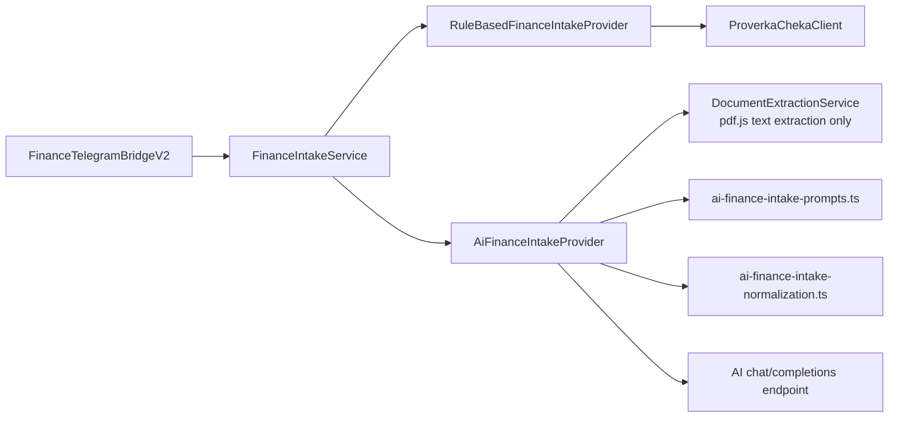
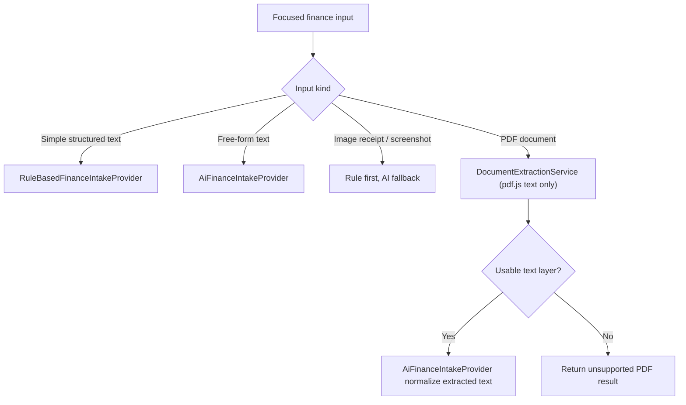
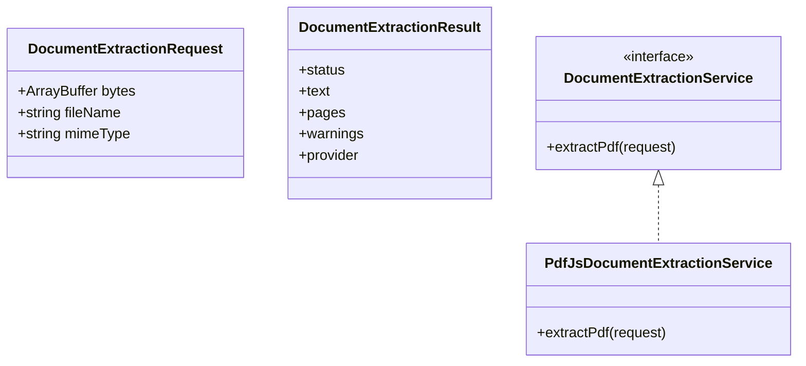
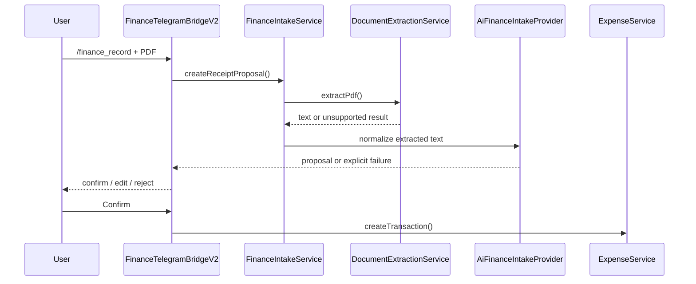

# AI Finance Intake Provider

This document describes the current, intentionally simplified shape of `AiFinanceIntakeProvider` inside `obsidian-expense-manager`.

The main goal of this iteration is clarity:

- keep the Telegram UX proposal-first
- keep deterministic parsing for the simple and reliable cases
- use AI only where it adds clear value
- support only `text-based PDF` documents
- reject image-only or scanned PDFs explicitly instead of hiding that behind multiple fallback layers

## Current Scope

`AiFinanceIntakeProvider` currently handles:

- free-form text in `/finance_record`
- non-QR receipt and finance screenshots
- text-based PDF finance documents after local text extraction

`AiFinanceIntakeProvider` does not currently handle:

- direct vault writes
- duplicate detection
- Telegram callback UX
- image-only or scanned PDFs
- general OCR platform behavior for other plugins

## Runtime Boundary

Interpretation:

- `FinanceTelegramBridgeV2` owns transport and confirmation UX
- `FinanceIntakeService` owns routing
- `RuleBasedFinanceIntakeProvider` owns structured text and QR-first receipt handling
- `AiFinanceIntakeProvider` owns free-form normalization and text-based PDF normalization

## Internal Support Modules

To keep `finance-intake-service.ts` readable, the AI provider now delegates two internal concerns:

- [ai-finance-intake-prompts.ts](C:/Users/petro/OneDrive/Документы/codex_projects/obsidian/obsidian-expense-manager/src/services/ai-finance-intake-prompts.ts)
  - prompt text
  - user payload shapes
  - JSON envelope parsing
- [ai-finance-intake-normalization.ts](C:/Users/petro/OneDrive/Документы/codex_projects/obsidian/obsidian-expense-manager/src/services/ai-finance-intake-normalization.ts)
  - payload normalization
  - field confidences and issue mapping
  - description fallback rule

The main runtime files are now split like this:

- [finance-intake-types.ts](C:/Users/petro/OneDrive/Документы/codex_projects/obsidian/obsidian-expense-manager/src/services/finance-intake-types.ts)
- [ai-finance-intake-provider.ts](C:/Users/petro/OneDrive/Документы/codex_projects/obsidian/obsidian-expense-manager/src/services/ai-finance-intake-provider.ts)
- [finance-intake-service.ts](C:/Users/petro/OneDrive/Документы/codex_projects/obsidian/obsidian-expense-manager/src/services/finance-intake-service.ts)

## Current Routing Policy

## PDF Policy

The PDF policy is now deliberately narrow:

- `pdf.js` is the only supported PDF text extractor
- if `pdf.js` returns usable text, that text is normalized by AI into a finance proposal
- if `pdf.js` returns no usable text, the request fails closed with an explicit unsupported message

Why this is the current choice:

- it keeps the implementation understandable
- it removes a large amount of brittle fallback code
- it matches the product reality better than pretending scanned PDFs are supported

## Provider Responsibilities

`AiFinanceIntakeProvider` is responsible for:

- building strict JSON extraction prompts
- calling the configured AI endpoint
- normalizing AI output into the shared finance extraction contract
- preserving warnings and field confidences
- turning extracted PDF text into a proposal candidate

`AiFinanceIntakeProvider` is not responsible for:

- confirmation UI
- saving to vault
- report updates
- deduplication
- retrying across multiple PDF extraction strategies

## Text Extraction Contract

The local `DocumentExtractionService` currently exposes one concern:

- `extractPdf(request) -> DocumentExtractionResult`

## Telegram Flow

## Debugging Model

The current logging approach is:

- write structured intake logs to `ExpenseManager/debug-log.md`
- log routing decisions
- log PDF extraction status and warnings
- log AI request/response previews in truncated form

This is intentional because AI-backed intake is much easier to reason about when extraction and normalization are visible as separate steps.

## Known Limits

- scanned or image-only PDFs are not supported
- encrypted PDFs are not supported
- very noisy or partially garbled PDF text may still fail conservative validation
- AI still needs user confirmation, especially for category, project, area, and description cleanup

## Near-Term Improvements

The next improvements should optimize for readability and reliability, not feature sprawl:

- tighten internal module boundaries further if `FinanceIntakeService` grows again
- add more narrow regression tests around PDF text extraction quality gates
- keep documentation and diagrams synchronized with actual supported behavior
- revisit scanned-PDF/OCR support only as a separate, intentional iteration
