# Email Finance Intake Architecture

This document explains the current email finance intake implementation as code-level diagrams.

The main idea of the current design is:

`mail sync -> coarse filter -> parser chain -> message planning -> finance proposal extraction -> merge -> pending-approval / needs-attention note`

The current implementation supports:

- `IMAP (login + app password)`
- `HTTP JSON bridge`
- manual sync command
- persisted delta-sync boundary
- `pending-approval` transaction notes that stay out of analytics until approval
- `needs-attention` transaction notes for emails that looked finance-related but did not yield a valid proposal

## 1. High-Level Runtime View

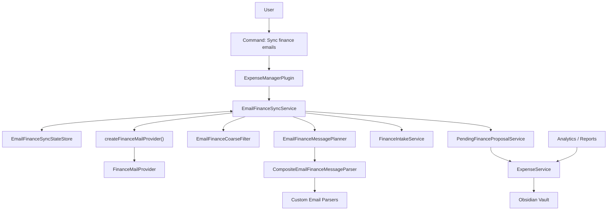

## 2. End-to-End Sequence

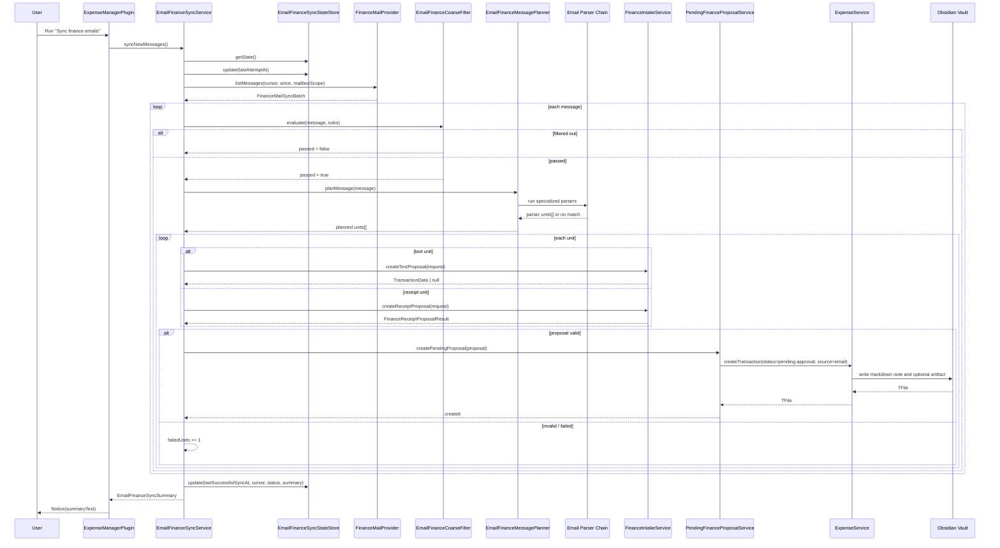

## 3. Provider Selection

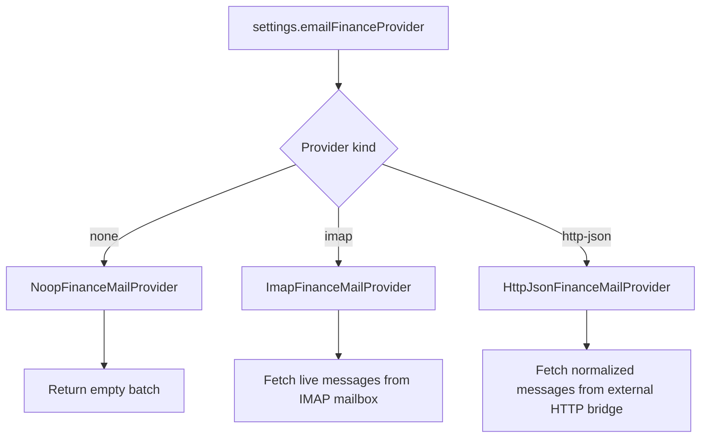

## 4. IMAP Provider Internals

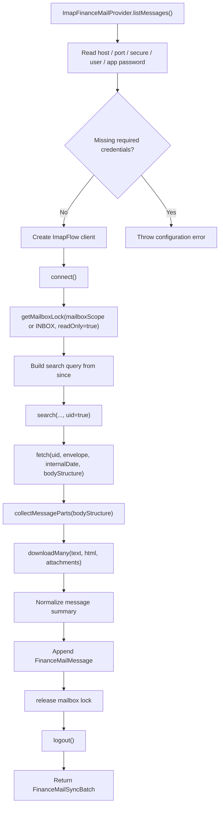

### IMAP extraction details

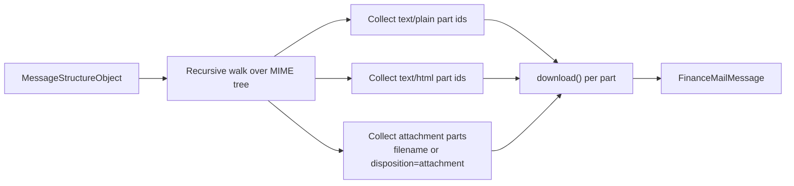

## 5. Coarse Filter Logic

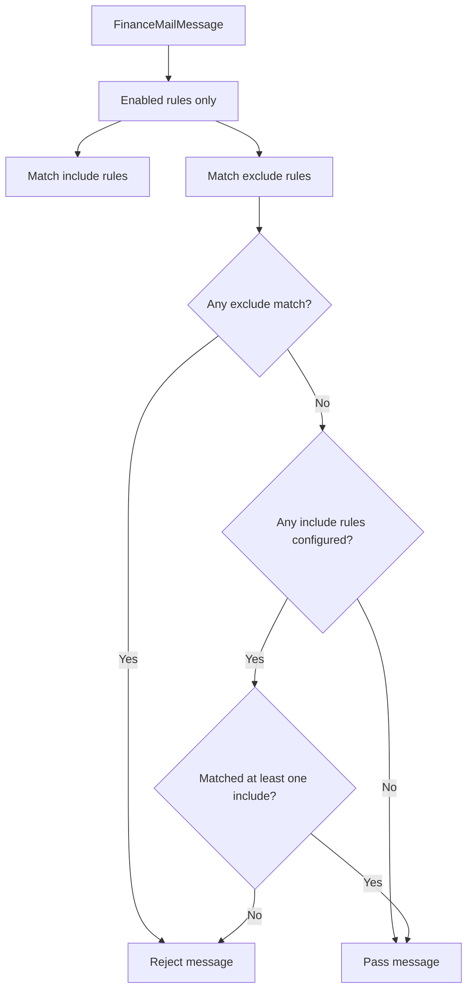

Fields that can be matched:

- `from`
- `subject`
- `body`
- `attachmentName`
- `any`

Modes:

- `contains`
- `regex`

## 6. Parser Chain And Message Planning

The planner is no longer only a generic attachment/text router.
It now starts with a parser chain that can short-circuit generic planning for known scenarios.

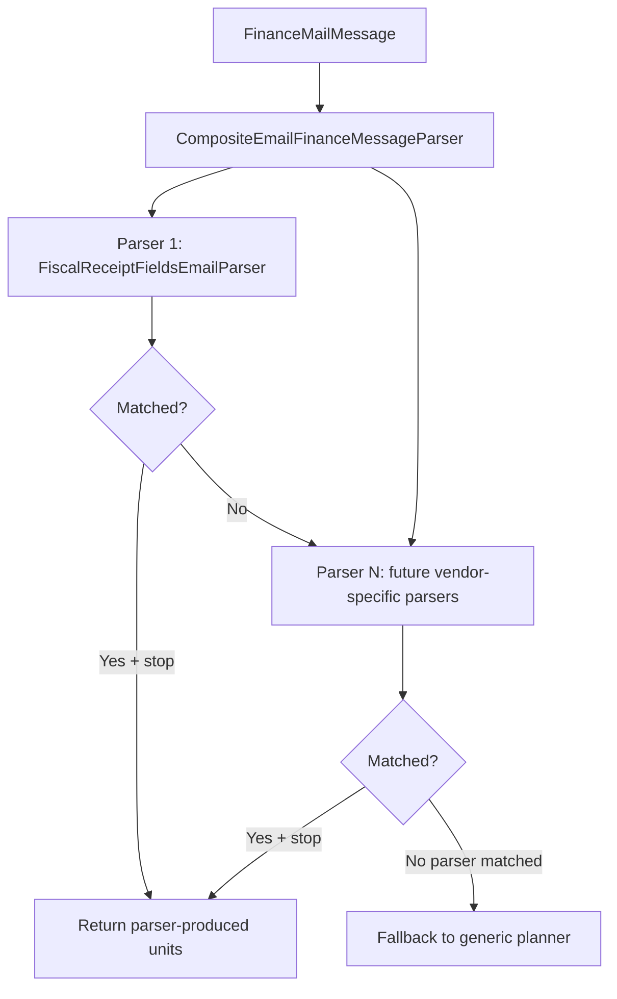

Current purpose of the parser layer:

- extract canonical fiscal receipt fields from email body
- support vendor-specific or format-specific parsing without polluting generic planner logic
- leave generic attachments/text fallback in place for everything else

## 7. Generic Planner Fallback

The planner turns one email into zero, one, or many intake units.

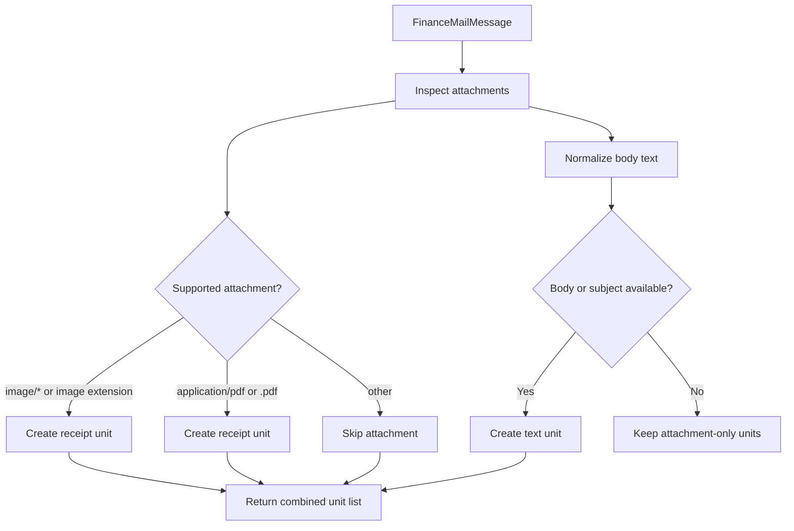

Current rule:

- supported attachments and text body can both produce units for the same email
- duplicate suppression happens after extraction, not at planning time
- this deliberately prefers recall over silence, because missed expenses are worse than duplicate candidates

## 8. Fiscal Receipt Extraction Path

The first specialized parser currently targets receipt-like emails that contain enough fiscal fields in text or HTML to reconstruct the canonical QR payload.

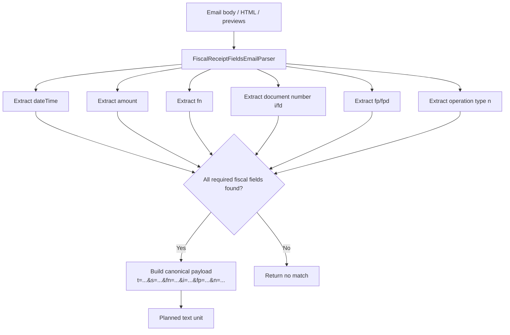

Why this layer exists:

- it turns email receipts into a structured transport payload before AI routing
- it gives us a reusable place for provider-specific parsers
- it lets us preserve fiscal identifiers for dedupe and future enrichment

## 9. Proposal Routing Inside FinanceIntakeService

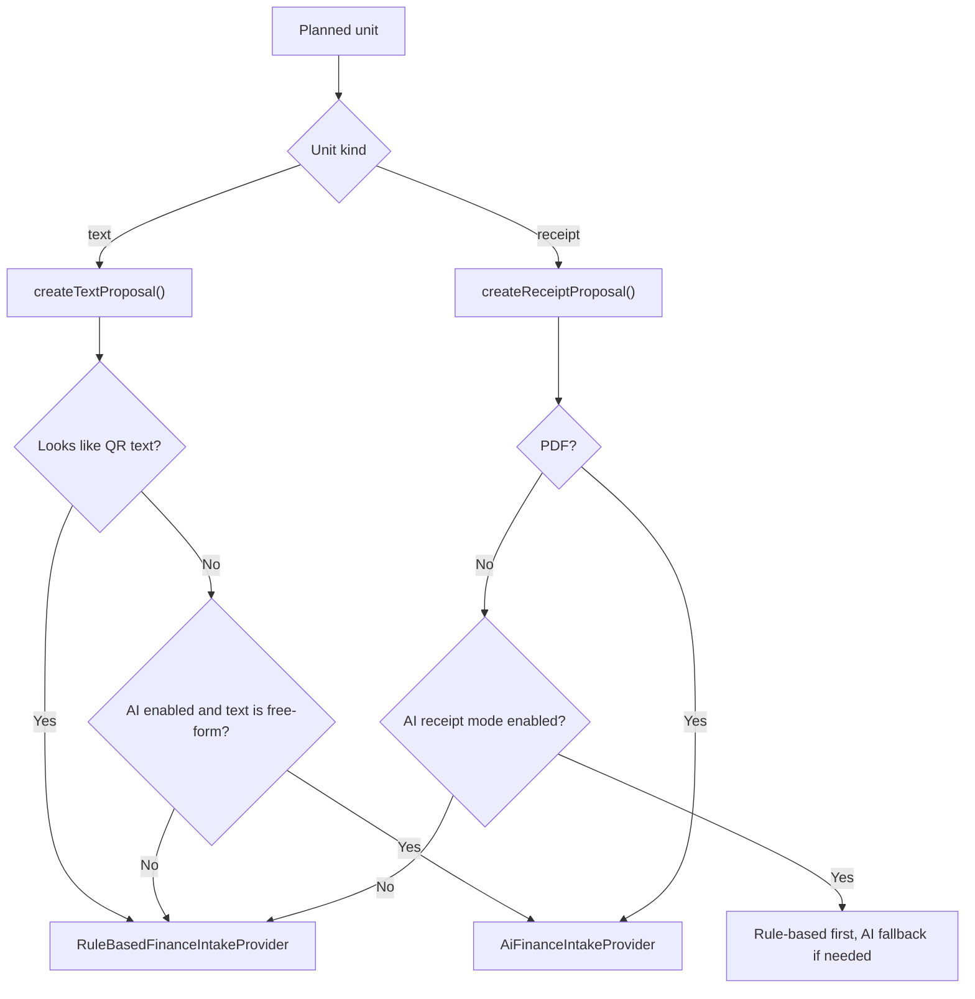

Important routing nuance:

- raw QR route should trigger only for genuine compact QR payloads
- email bodies that merely contain `fn=...&fp=...` inside a URL or prose should not be treated as raw QR strings

## 10. Pending Proposal Persistence

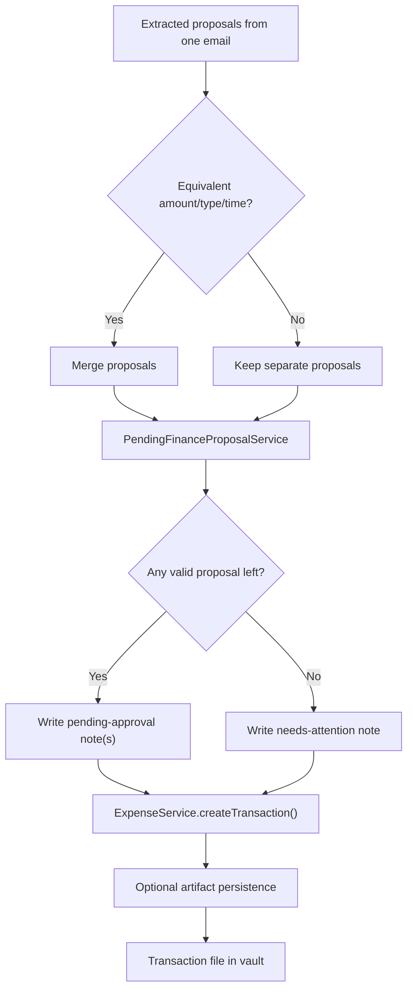

Tag normalization currently removes transport-level leftovers such as:

- `manual`
- `telegram`
- `email`
- `api`
- `pdf`

## 11. Transaction Lifecycle

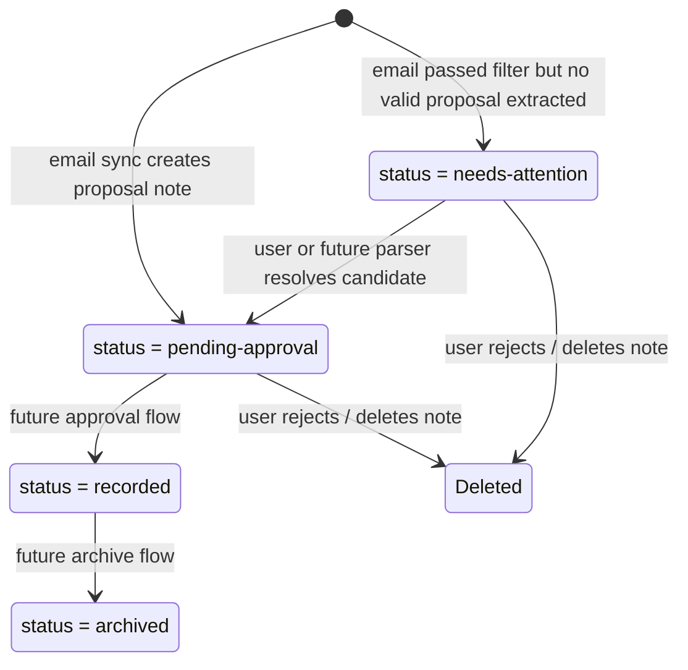

Current reporting rule:

- analytics and reports read `recorded` transactions by default
- duplicate detection checks both `recorded` and `pending-approval`
- `needs-attention` notes stay out of analytics and do not block future real transaction creation

## 12. Sync State Model

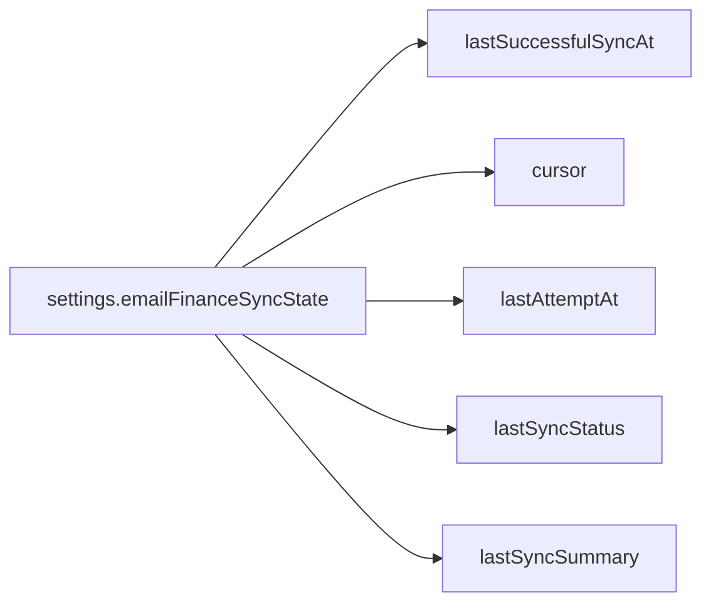

Current usage:

- `lastSuccessfulSyncAt` is used as the delta-sync boundary
- `cursor` is preserved for providers that support cursor-based pagination
- `lastAttemptAt`, `lastSyncStatus`, and `lastSyncSummary` are used for operator visibility in settings

## 13. HTML Receipt Caveat: "QR As Grid"

Some receipt emails do not embed QR as:

- attachment image
- linked PNG/JPEG
- CID inline image

Instead, the QR is rendered directly in HTML as a large grid of black and white blocks.

Architectural implication:

- this should not be treated as a generic image-attachment case
- it should be handled by a dedicated parser when we have enough evidence that the pattern is stable
- for now, the safer general strategy is:
  - prefer extracting fiscal fields from text/HTML
  - preserve HTML links and image sources as context
  - add vendor-specific HTML parsers only when a repeated pattern is confirmed

## 14. Main Entry Points In Code

- [main.ts](C:/Users/petro/OneDrive/Документы/codex_projects/obsidian/obsidian-expense-manager/main.ts)
  - settings UI, command registration, sync service creation
- [sync-finance-emails.ts](C:/Users/petro/OneDrive/Документы/codex_projects/obsidian/obsidian-expense-manager/src/email-finance/commands/sync-finance-emails.ts)
  - command wiring
- [email-finance-sync-service.ts](C:/Users/petro/OneDrive/Документы/codex_projects/obsidian/obsidian-expense-manager/src/email-finance/sync/email-finance-sync-service.ts)
  - orchestration
- [finance-mail-provider.ts](C:/Users/petro/OneDrive/Документы/codex_projects/obsidian/obsidian-expense-manager/src/email-finance/transport/finance-mail-provider.ts)
  - provider abstraction plus IMAP and HTTP implementations
- [email-finance-coarse-filter.ts](C:/Users/petro/OneDrive/Документы/codex_projects/obsidian/obsidian-expense-manager/src/email-finance/sync/email-finance-coarse-filter.ts)
  - pre-routing message filtering
- [email-finance-message-planner.ts](C:/Users/petro/OneDrive/Документы/codex_projects/obsidian/obsidian-expense-manager/src/email-finance/planning/email-finance-message-planner.ts)
  - parser-first planning plus generic fan-out into intake units
- [email-finance-message-parsers.ts](C:/Users/petro/OneDrive/Документы/codex_projects/obsidian/obsidian-expense-manager/src/email-finance/parsers/email-finance-message-parsers.ts)
  - parser registry, parser contracts, and fiscal receipt extraction
- [finance-intake-service.ts](C:/Users/petro/OneDrive/Документы/codex_projects/obsidian/obsidian-expense-manager/src/services/finance-intake-service.ts)
  - proposal extraction routing
- [pending-finance-proposal-service.ts](C:/Users/petro/OneDrive/Документы/codex_projects/obsidian/obsidian-expense-manager/src/email-finance/review/pending-finance-proposal-service.ts)
  - conversion from proposal to pending transaction note
- [expense-service.ts](C:/Users/petro/OneDrive/Документы/codex_projects/obsidian/obsidian-expense-manager/src/services/expense-service.ts)
  - persistence, duplicate checks, transaction reads

## 15. Recommended File Split

The current code works, but email intake is now large enough that keeping every piece under `src/services/` will get noisy.

Recommended future split:

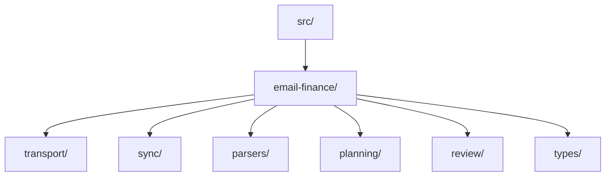

Suggested mapping:

- `transport/`
  - IMAP provider
  - HTTP bridge provider
  - provider contracts
- `sync/`
  - sync service
  - sync state store
  - coarse filter
- `parsers/`
  - parser contracts
  - parser registry
  - fiscal field parser
  - future Yandex/vendor parsers
  - future HTML QR-grid parser
- `planning/`
  - generic message planner
  - planner unit types
- `review/`
  - pending proposal persistence
  - later approval/rejection transitions
- `types/`
  - email message summary and parser/planner shared types

Practical recommendation:

- keep cross-domain generic pieces in `services/`
- move email-intake-specific pieces into a dedicated feature folder once the next parser or approval flow lands
- do not move `FinanceIntakeService` or `ExpenseService`, because they are still shared application services rather than email-only internals

## 16. Known Gaps In The Current Design

- no scheduler yet, only manual sync
- IMAP provider does not yet mark messages as processed server-side
- parser registry is still small; only the fiscal field parser exists today
- vendor-specific receipt link parsers are not implemented yet
- HTML QR-grid rendering is not parsed as a first-class receipt artifact yet
- merge heuristics are intentionally simple for now: type + currency + amount + near dateTime
- one message can produce many pending notes, but there is not yet a dedicated review UI for them
- Telegram approval flow for `pending-approval` notes is still a future phase
