# Email Finance Intake Architecture

This document explains the current email finance intake implementation as code-level diagrams.

The main idea of the current design is:

`mail sync -> coarse filter -> parser chain -> message planning -> finance proposal extraction -> duplicate check -> pending-approval / needs-attention / duplicate note`

The current implementation supports:

- `Workspace email-provider plugin` as the recommended transport host
- removed legacy `IMAP` / `HTTP JSON bridge` runtime with on-load settings normalization
- manual sync command
- scheduled sync on a configurable interval while Obsidian is open
- per-run message cap with saved cursor resume for large initial backfills
- persisted delta-sync boundary
- generic `evidence -> resolution -> proposal` receipt layer
- deterministic text-based PDF preflight before AI fallback
- `pending-approval` transaction notes that stay out of analytics until approval
- `needs-attention` transaction notes for emails that looked finance-related but did not yield a valid proposal
- `duplicate` transaction notes instead of silent duplicate drops
- rebuild of an email-derived transaction from saved source identity
- dedicated Obsidian duplicate merge workflow
- configurable rejected-item retention policy for review notes
- Telegram review of pending email proposals through `/finance_review`
- optional Telegram notifications when sync creates new pending-approval notes
- parser-attempt diagnostics in runtime logs

## 0. Current Iteration Summary

Current state after the latest live mailbox iteration:

- mailbox transport has now been split out into `obsidian-email-provider`, while finance parsing and review logic remain in `obsidian-expense-manager`
- `obsidian-email-provider` already provides:
  - channel settings
  - IMAP driver execution
  - full message fetch and attachment materialization
  - checkpoint persistence
  - multi-channel search with an opaque composite cursor
- `Expense Manager` now uses `obsidian-email-provider` as the recommended path for:
  - mailbox search
  - rebuild fetch-by-id
  - sync boundary storage
- generic `ResolvedReceiptEvidenceEmailParser` is no longer experimental-only; it now closes a meaningful share of real receipt emails before vendor-specific logic is needed
- scheduled sync, bounded backfill batches, and Telegram email-sync notifications now exist as first-class operator controls rather than placeholders in settings
- confirmed live deterministic coverage now includes:
  - Yandex receipt emails
  - multiple Lenta families
  - Magnit receipt emails
  - several OFD / receipt-link families that resolve through the generic evidence layer
- text-based PDF receipts can now succeed without AI when local PDF extraction yields enough fiscal text
- timestamp extraction is now more resilient when the authoritative receipt time lives in raw HTML attributes or in text-based PDF timestamps with seconds
- manual review ergonomics improved:
  - manual Obsidian entry now supports explicit date/time editing and save-as-draft
  - pending notes can be previewed from Telegram review before confirmation
  - note filename and dated folder placement can be re-synced from frontmatter after manual edits
  - Telegram confirmation of edited pending notes uses the same storage-sync path
  - duplicate candidates now remain visible as notes and can be merged in a dedicated Obsidian modal
  - email-derived notes can be rebuilt later from `email_msg_id`
- rejected review notes are now governed by policy instead of a hardcoded delete-only path
- the main intentionally open gap remains auth-gated Ozon receipt retrieval

The biggest architectural lesson from this iteration is:

`generic evidence extraction + thin vendor adapters` scales better than growing a large set of fully custom vendor parsers.

## 1. High-Level Runtime View

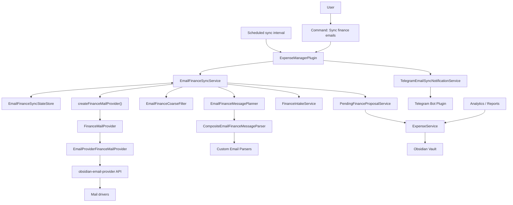

## 2. End-to-End Sequence

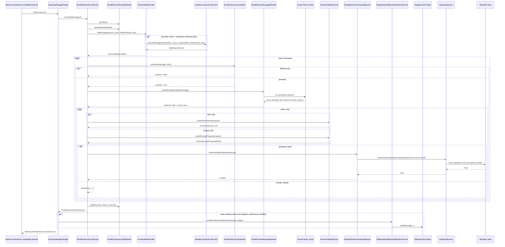

## 3. Provider Selection

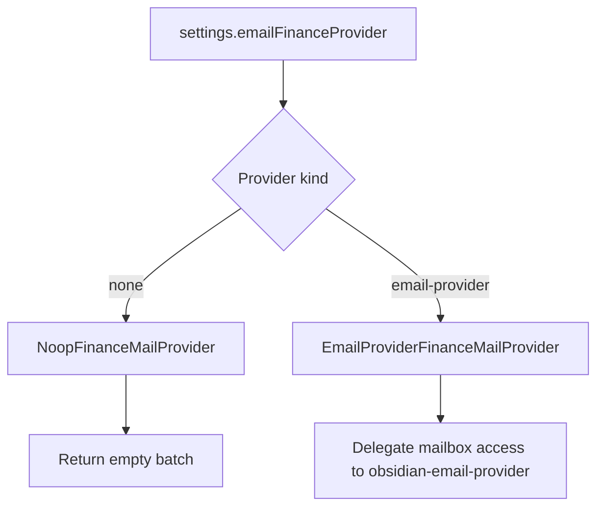

Recommended mode:

- `email-provider` is now the primary architecture
- built-in legacy `imap` and `http-json` runtime paths have been removed
- older vault settings that still point at removed transports are normalized on load into `email-provider`
- old finance notes still retain rebuild compatibility when migrating from legacy IMAP to `email-provider`

## 4. Workspace Email Provider Mode

In the recommended mode, `Expense Manager` no longer owns mailbox transport directly.

Instead it:

- discovers `obsidian-email-provider` at runtime
- resolves either one selected channel or an explicit multi-channel selection
- calls `searchMessages`, `getMessage`, and `materializeAttachment` through the shared API
- stores its sync checkpoint in `obsidian-email-provider`
- mirrors the effective sync state back into local settings for operator visibility

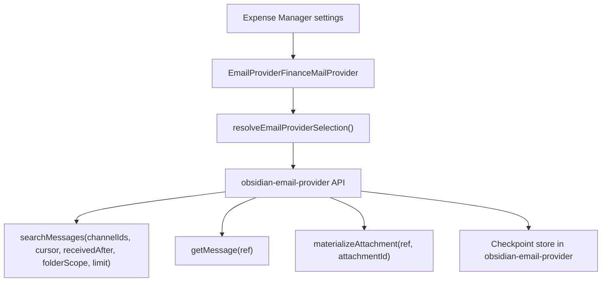

Current behavior in this mode:

- one sync can target one or many channels
- multi-channel search uses an opaque composite cursor owned by `obsidian-email-provider`
- the checkpoint key is built from:
  - consumer id
  - one channel id, or a synthetic channel-selection key
  - a fixed default scope fingerprint on the consumer side
- saved finance notes keep stable provider ids such as `email-provider:<channelId>:<externalId>`
- the actual mailbox scope used for a message is persisted per note from the provider response rather than from an `Expense Manager` setting

## 4a. Removed Legacy Transport Runtime

`Expense Manager` no longer contains built-in mailbox transports such as direct IMAP or the HTTP JSON bridge.

What remains:

- finance-note rebuild compatibility for older notes that still say `email_provider: imap`
- older vault settings that still reference removed built-in mail transports are normalized into `email-provider` on load
- obsolete IMAP / HTTP bridge config payload is removed from the saved plugin settings during normalization

After normalization, the operator should verify mailbox channels in `obsidian-email-provider` if the old vault relied on built-in transport settings.

## 5. Coarse Filter Logic

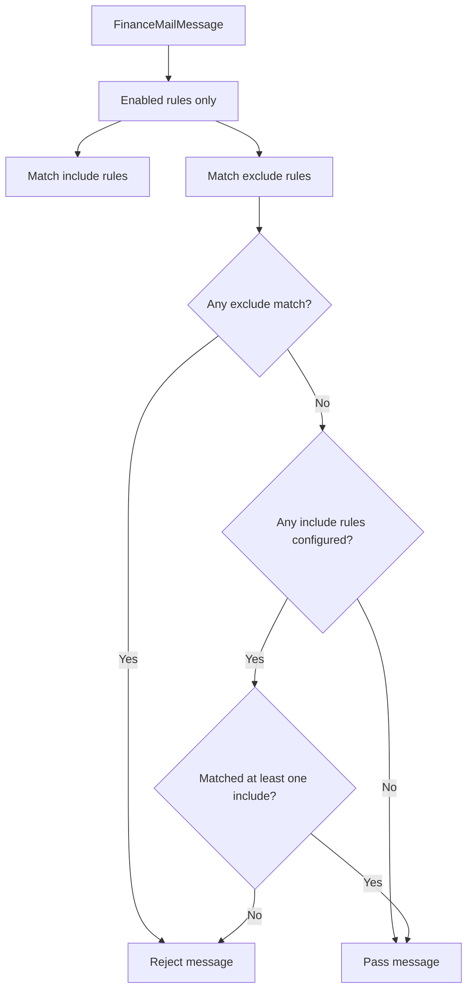

Fields that can be matched:

- `from`
- `subject`
- `body`
- `attachmentName`
- `any`

Modes:

- `contains`
- `regex`

## 6. Parser Chain And Message Planning

The planner is no longer only a generic attachment/text router.
It now starts with a parser chain that can short-circuit generic planning for known scenarios.

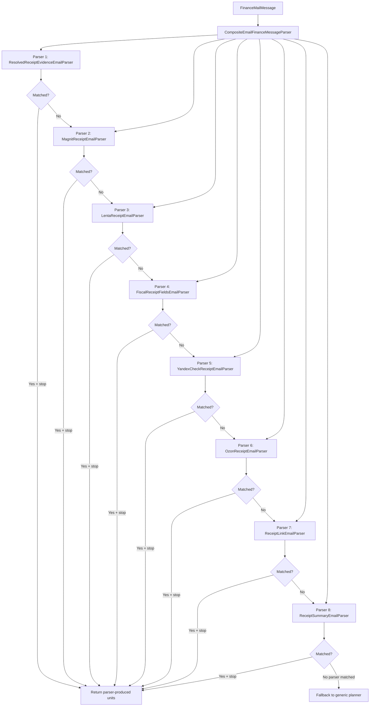

Current purpose of the parser layer:

- extract canonical fiscal receipt fields from email body
- handle repeated vendor-specific formats without polluting generic planning
- prefer deterministic transport payloads when a receipt email already contains fiscal evidence
- collect conflicting receipt evidence before generic AI fallback
- support vendor-specific or format-specific parsing without polluting generic planner logic
- leave generic attachments/text fallback in place for everything else

Current concrete parser order:

- `resolved-receipt-evidence`
- `magnit-receipt`
- `lenta-receipt`
- `fiscal-receipt-fields`
- `yandex-check-receipt`
- `ozon-receipt`
- `receipt-link`
- `receipt-summary`

Planner diagnostics now include:

- one parser-attempt log entry per parser
- `matched` / `no-match`
- `reason`
- compact parser diagnostics such as sender domain, link counts, image-source counts, QR URL candidates, and whether amount/dateTime/fiscal fields were found
- a separate message-signal snapshot before parser evaluation with:
  - normalized body preview
  - `href` link samples
  - HTML `img src` samples
  - `data:image/...` counts
  - fiscal fields reconstructed from body vs QR URL candidates
  - generic evidence summary with:
    - total evidence items
    - resolved canonical fiscal payload when available
    - conflicting fiscal payload candidates
    - amount/dateTime candidate sets
- whether generic fallback was used after parser chain evaluation

## 6a. Generic Evidence Layer

We now have a thin generic `evidence -> resolution -> proposal` layer alongside vendor parsers.

Its job is intentionally narrower than a full transaction parser:

- collect candidate evidence from different channels
- preserve provenance and confidence
- resolve only strong, non-conflicting receipt facts
- abstain when evidence conflicts instead of forcing a bad proposal

Current evidence channels:

- normalized body text
- QR-like payloads reconstructed from `href` / `img src`
- inline `data:image/...` sources
- receipt-like links
- `Wallet Mail.ru` JSON total when present

Current resolution rules:

- canonical `qrraw` wins only when it can be reconstructed unambiguously
- if equally strong fiscal payload candidates disagree, generic evidence resolution returns `no match`
- medium-confidence values like amount/dateTime are logged as evidence, but do not override a missing or conflicting canonical fiscal payload
- generic evidence resolution now runs before vendor-specific adapters
- vendor-specific parsers remain the preferred place for format-specific wrappers, redirects, inline image conventions, and unusual encodings

Why this layer exists:

- reduce the need for a new vendor parser every time a sender moves the same `qrraw` between body, `href`, and `img src`
- make evidence conflicts explicit instead of letting them leak into duplicate or low-quality proposals
- keep vendor-specific parsers thin and focused on wrappers, redirects, and unusual encodings

Current observed outcome:

- the generic layer now successfully resolves real receipts from several families that previously needed either custom adapters or AI fallback
- this includes messages where the fiscal payload is spread across:
  - body text plus receipt links
  - QR-like URLs in `href` / `img src`
  - OFD-style path parameters
  - partially corrupted URL payloads that need repair before parsing

## 7. Generic Planner Fallback

The planner turns one email into zero, one, or many intake units.

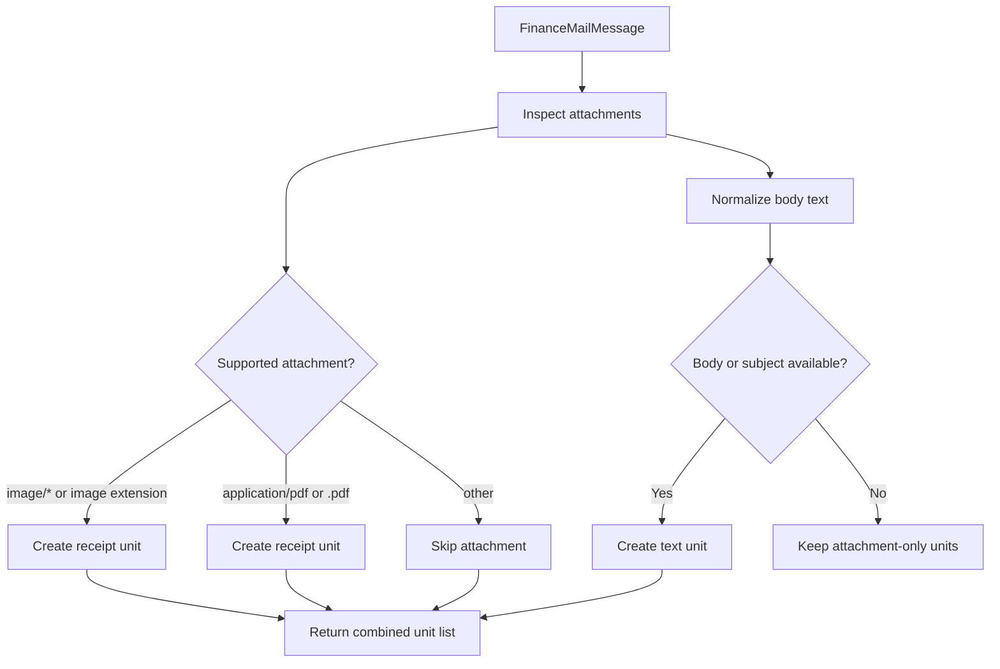

Current rule:

- supported attachments and text body can both produce units for the same email
- duplicate suppression happens after extraction, not at planning time
- this deliberately prefers recall over silence, because missed expenses are worse than duplicate candidates

Fallback observability:

- planner logs attachment unit count
- planner logs whether generic text fallback was created
- sync logs parser trace and final planned units together for each message

## 8. Fiscal Receipt Extraction Path

The first specialized parser currently targets receipt-like emails that contain enough fiscal fields in text or HTML to reconstruct the canonical QR payload.

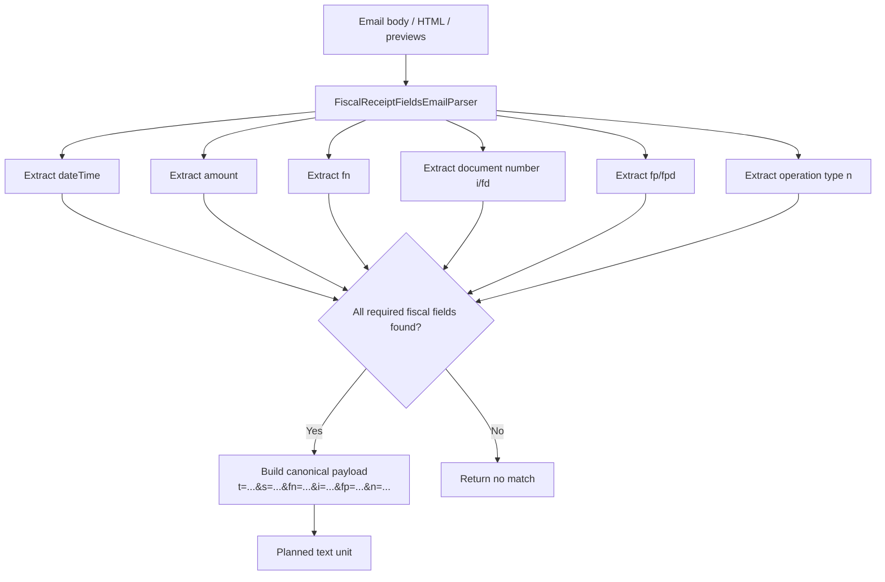

Why this layer exists:

- it turns email receipts into a structured transport payload before AI routing
- it gives us a reusable place for provider-specific parsers
- it lets us preserve fiscal identifiers for dedupe and future enrichment

## 8a. Yandex Receipt Parser Path

`check.yandex.ru` receipts are now a confirmed working vendor-specific case.

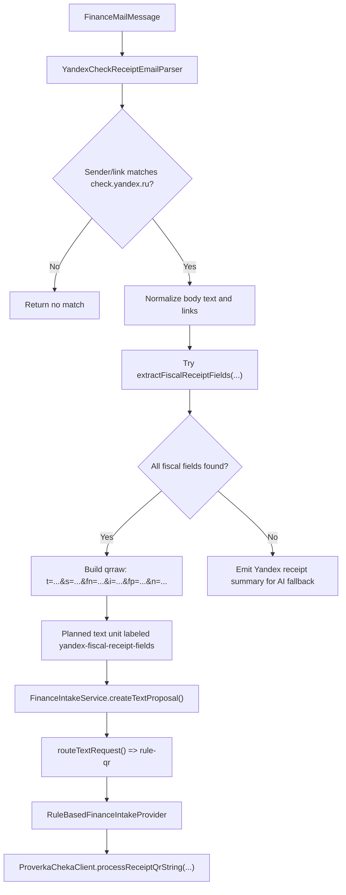

Current observed behavior:

- Yandex receipt emails can now bypass the generic AI-only path
- when fiscal fields are extracted, the planner emits a canonical `qrraw` payload
- `FinanceIntakeService` routes that payload into deterministic `rule-qr`
- downstream normalization then uses `ProverkaCheka`, not LLM inference, for the core receipt facts

Important nuance:

- this path depends on correct email-body decoding first
- normal email URLs with `=` in query params must not be mistaken for quoted-printable transport encoding
- otherwise the fiscal parser sees corrupted `Когда / Сколько / ФН / ФД / ФПД` fields and falls back too early

## 8b. Lenta Format Variants

`Lenta` receipts currently exist in at least three materially different email families:

- legacy format:
  - sender typically `noreply@ofd.ru`
  - HTML receipt body contains classic OFD markup
  - links often point to `ofd.ru/Document/RenderDoc...`
  - QR evidence may be embedded as inline HTML content or other legacy OFD structures
  - one confirmed subtype embeds QR as `data:image/png;base64,...`
- newer Taxcom-backed format:
  - sender typically `noreply@taxcom.ru`
  - links point to `receipt.taxcom.ru/...`
  - QR payload may live in HTML `img src`, for example `api-lk-ofd.taxcom.ru/images/qr?code=t%3D...`
  - mail clients may additionally wrap that image URL through `resize.yandex.net/mailservice?...`
- `lenta.com / upmetric / eco-check` format:
  - sender may be `noreply@lenta.com`
  - receipt links often point to `check.lenta.com`, `eco-check.ru`, or `prod.upmetric.ru/receiptview/...`
  - QR payload may live in HTML `img src` as `https://api.qrserver.com/v1/create-qr-code/?data=t=...`
  - body may also include `Wallet Mail.ru` JSON with useful total/merchant context

Current confirmed implementation:

- the same `LentaReceiptEmailParser` now covers all three families above
- old OFD `data:image` emails emit a first-class `receipt` unit such as `receipt:lenta-inline-qr-image`
- Taxcom and `lenta.com / upmetric / qrserver` variants reconstruct canonical `qrraw`
- once `qrraw` is reconstructed, the message goes through deterministic `rule-qr -> ProverkaCheka`

Why this matters architecturally:

- vendor identity can no longer be inferred from sender domain alone
- some receipt families keep the canonical fiscal payload in `href`
- others keep it in `img src`
- some legacy HTML receipts keep the QR only as inline `data:image`
- parser trace therefore has to surface both link classes before we can explain a `no-match`
- safe URL extraction has to be treated separately from generic body decoding

Important implementation nuance:

- HTML `href` / `src` extraction must not reuse the same aggressive transfer-decoding strategy as free-form body text
- otherwise valid QR URL payloads like `t=20260404T1044...` can degrade into `t 260404T1044...`
- receipt amount extraction must also avoid matching unrelated tracking params such as marketing `s=...` query fragments

Practical takeaway:

- for receipt emails, `decoded body text` and `decoded URL attributes` are different evidence channels
- parser diagnostics should continue to show both channels explicitly
- when one channel degrades, the other often still preserves the canonical fiscal payload

Current observability for Lenta-family debugging:

- `Email finance planner message signals`
  - sender domain
  - normalized body preview
  - extracted `href` links
  - extracted HTML image sources
  - `data:image/...` counts
  - reconstructed fiscal payloads from body and QR URL candidates
- `Email finance parser attempt`
  - parser-specific `reason`
  - matched / no-match
  - Lenta-specific diagnostics such as:
    - `hasLegacyLentaReceiptLink`
    - `hasTaxcomReceiptLink`
    - `hasTaxcomQrImageLink`
    - `hasLentaReceiptRedirectLink`
    - `hasQrServerImageLink`
    - `qrUrlCandidateSamples`
    - `dataUrlImageSamples`
    - `inlineReceiptByteLength` when a data-url image is converted into a receipt unit

## 8c. Confirmed Parser Families

Current parser status based on real mailbox runs:

- `YandexCheckReceiptEmailParser`
  - confirmed
  - deterministic `qrraw -> rule-qr -> ProverkaCheka`
- `LentaReceiptEmailParser`
  - confirmed
  - covers legacy `ofd.ru`, newer `taxcom.ru`, and `lenta.com / upmetric / eco-check / qrserver` variants
- `MagnitReceiptEmailParser`
  - confirmed on live mailbox data
  - deterministic result may now come either from Magnit-specific logic or from the generic evidence layer resolving the same fiscal payload first
- `ResolvedReceiptEvidenceEmailParser`
  - confirmed as a first-class deterministic path
  - now resolves multiple live families without brand-specific adapters
  - especially useful for OFD-style receipts, QR-like receipt links, and messages where `qrraw` can be reconstructed from mixed evidence
- text-based PDF preflight in `FinanceIntakeService`
  - confirmed for PDF receipts with extractable text layers
  - local `pdf.js` extraction can now reconstruct fiscal payloads before any AI fallback is attempted
- `OzonReceiptEmailParser`
  - parser scaffolding exists
  - downstream artifact download is currently auth-gated, so this family is not yet fully automated
- generic `receipt-link` and `receipt-summary`
  - fallback only
  - useful for reducing total misses, but not a substitute for vendor-specific deterministic parsing

## 9. Proposal Routing Inside FinanceIntakeService

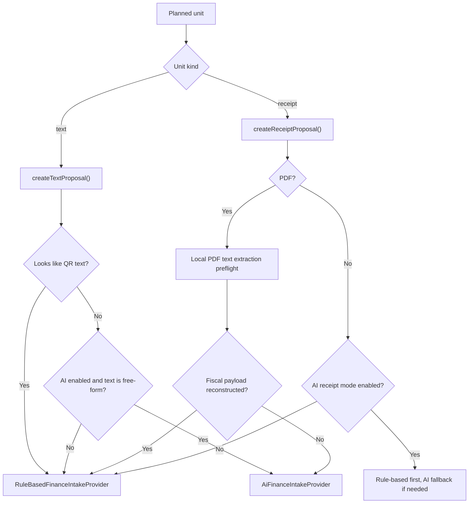

Important routing nuance:

- raw QR route should trigger only for genuine compact QR payloads
- email bodies that merely contain `fn=...&fp=...` inside a URL or prose should not be treated as raw QR strings
- for PDF receipts, routing is now effectively:
  - local `pdf.js` text extraction
  - attempt deterministic fiscal reconstruction from PDF text, optionally combined with caption context
  - only then allow AI fallback if needed and configured

## 10. Proposal Persistence And Review States

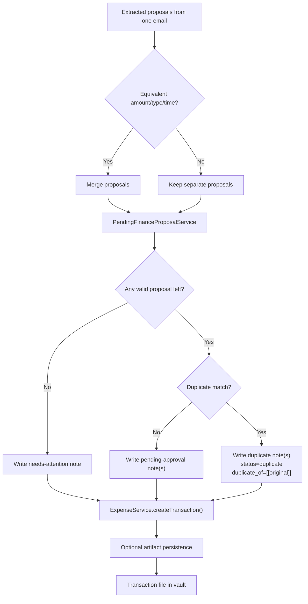

Tag normalization currently removes transport-level leftovers such as:

- `manual`
- `telegram`
- `email`
- `api`
- `pdf`

Current review-specific persistence behavior:

- pending proposals become normal finance notes with status `pending-approval`
- likely duplicates are stored instead of discarded and get `status: duplicate`
- duplicate notes keep a `duplicate_of` link to the original transaction
- email-derived notes store `email_msg_id`, `email_provider`, and `email_mailbox_scope` in frontmatter
- rejected saved notes can either be archived with status `rejected` or deleted immediately, depending on settings

## 11. Transaction Lifecycle

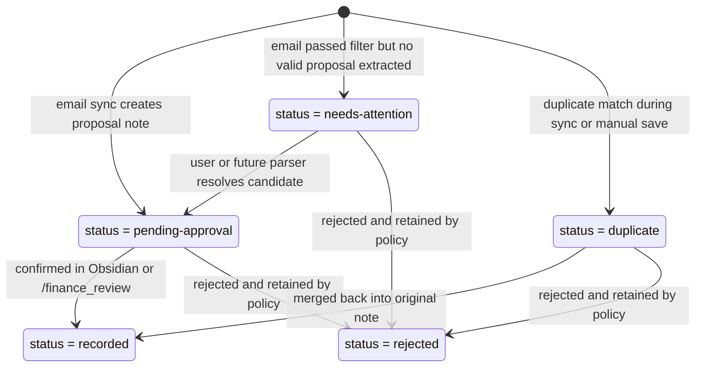

Current reporting rule:

- analytics and reports read `recorded` transactions by default
- duplicate detection checks both `recorded` and `pending-approval`
- `pending-approval`, `needs-attention`, `duplicate`, and `rejected` notes stay out of analytics
- when rejected retention is disabled, rejection ends in immediate deletion rather than a terminal stored note

## 12. Sync State Model

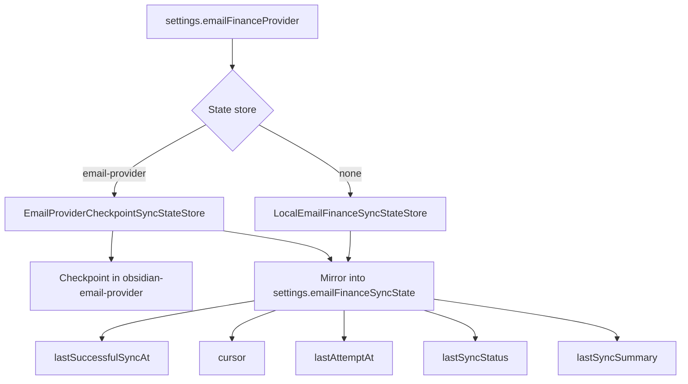

Current usage:

- `settings.emailFinanceSyncState` is always the operator-visible mirror
- in `email-provider` mode, the authoritative checkpoint lives in `obsidian-email-provider`
- when email sync is disabled, the local settings snapshot remains the only mirror
- `lastSuccessfulSyncAt` is the stable delta-sync boundary for completed batches
- `cursor` is the active continuation boundary for partially consumed paginated backfills
- when `cursor` is non-null, sync resumes from that cursor before advancing `lastSuccessfulSyncAt`
- for multi-channel email-provider sync, the cursor belongs to the exact selected channel set
- `lastAttemptAt`, `lastSyncStatus`, and `lastSyncSummary` are used for operator visibility in settings

## 12a. Scheduled Sync And Notification Hooks

Current orchestration around sync triggers:

- `ExpenseManagerPlugin` can run email sync manually or on a configured interval
- scheduled sync runs only while Obsidian is open
- an in-flight guard prevents overlapping sync runs
- Telegram notification delivery is optional and happens only after a successful sync that created at least one new `pending-approval` note
- notification delivery failure is logged, but does not fail the sync itself

## 13. HTML Receipt Caveat: "QR As Grid"

Some receipt emails do not embed QR as:

- attachment image
- linked PNG/JPEG
- CID inline image

Instead, the QR is rendered directly in HTML as a large grid of black and white blocks.

Architectural implication:

- this should not be treated as a generic image-attachment case
- it should be handled by a dedicated parser when we have enough evidence that the pattern is stable
- for now, the safer general strategy is:
  - prefer extracting fiscal fields from text/HTML
  - preserve HTML links and image sources as context
  - add vendor-specific HTML parsers only when a repeated pattern is confirmed

## 14. Main Entry Points In Code

- [main.ts](C:/Users/petro/OneDrive/Документы/codex_projects/obsidian/obsidian-expense-manager/main.ts)
  - settings UI, command registration, sync service creation
- [sync-finance-emails.ts](C:/Users/petro/OneDrive/Документы/codex_projects/obsidian/obsidian-expense-manager/src/email-finance/commands/sync-finance-emails.ts)
  - command wiring
- [rebuild-current-email-transaction.ts](C:/Users/petro/OneDrive/Документы/codex_projects/obsidian/obsidian-expense-manager/src/email-finance/commands/rebuild-current-email-transaction.ts)
  - rebuild command wiring for email-derived transaction notes
- [email-finance-sync-service.ts](C:/Users/petro/OneDrive/Документы/codex_projects/obsidian/obsidian-expense-manager/src/email-finance/sync/email-finance-sync-service.ts)
  - orchestration
- [finance-mail-provider.ts](C:/Users/petro/OneDrive/Документы/codex_projects/obsidian/obsidian-expense-manager/src/email-finance/transport/finance-mail-provider.ts)
  - provider abstraction for `none` and workspace `email-provider` modes
- [email-provider-finance-mail-provider.ts](C:/Users/petro/OneDrive/Документы/codex_projects/obsidian/obsidian-expense-manager/src/email-finance/transport/email-provider-finance-mail-provider.ts)
  - adapter from finance sync into the workspace `obsidian-email-provider` API
- [client.ts](C:/Users/petro/OneDrive/Документы/codex_projects/obsidian/obsidian-expense-manager/src/integrations/email-provider/client.ts)
  - runtime discovery and channel-selection resolution for `obsidian-email-provider`
- [channel-selection.ts](C:/Users/petro/OneDrive/Документы/codex_projects/obsidian/obsidian-expense-manager/src/integrations/email-provider/channel-selection.ts)
  - parsing and normalization of explicit one-channel or multi-channel selections
- [email-finance-coarse-filter.ts](C:/Users/petro/OneDrive/Документы/codex_projects/obsidian/obsidian-expense-manager/src/email-finance/sync/email-finance-coarse-filter.ts)
  - pre-routing message filtering
- [email-finance-message-planner.ts](C:/Users/petro/OneDrive/Документы/codex_projects/obsidian/obsidian-expense-manager/src/email-finance/planning/email-finance-message-planner.ts)
  - parser-first planning, parser trace logging, and generic fan-out into intake units
- [email-finance-message-parsers.ts](C:/Users/petro/OneDrive/Документы/codex_projects/obsidian/obsidian-expense-manager/src/email-finance/parsers/email-finance-message-parsers.ts)
  - parser registry, parser contracts, parser-attempt reasons/diagnostics, fiscal receipt extraction, and vendor-specific parsers such as Magnit, Lenta, Yandex, and Ozon receipt emails
- [finance-intake-service.ts](C:/Users/petro/OneDrive/Документы/codex_projects/obsidian/obsidian-expense-manager/src/services/finance-intake-service.ts)
  - proposal extraction routing and text-based PDF deterministic preflight
- [pending-finance-proposal-service.ts](C:/Users/petro/OneDrive/Документы/codex_projects/obsidian/obsidian-expense-manager/src/email-finance/review/pending-finance-proposal-service.ts)
  - conversion from proposal to pending transaction note
- [telegram-email-sync-notification-service.ts](C:/Users/petro/OneDrive/Документы/codex_projects/obsidian/obsidian-expense-manager/src/services/telegram-email-sync-notification-service.ts)
  - optional Telegram notification delivery after successful syncs that created new pending review items
- [expense-service.ts](C:/Users/petro/OneDrive/Документы/codex_projects/obsidian/obsidian-expense-manager/src/services/expense-service.ts)
  - persistence, duplicate checks, transaction reads, rebuild updates, and rejected-note archiving helpers
- [duplicate-merge-workflow-service.ts](C:/Users/petro/OneDrive/Документы/codex_projects/obsidian/obsidian-expense-manager/src/services/duplicate-merge-workflow-service.ts)
  - compare/merge orchestration for original vs duplicate transaction notes
- [finance-review-workflow-service.ts](C:/Users/petro/OneDrive/Документы/codex_projects/obsidian/obsidian-expense-manager/src/services/finance-review-workflow-service.ts)
  - shared reject-policy orchestration for saved review notes
- [duplicate-merge-modal.ts](C:/Users/petro/OneDrive/Документы/codex_projects/obsidian/obsidian-expense-manager/src/ui/duplicate-merge-modal.ts)
  - Obsidian-first UI for resolving duplicate notes safely
- [obsidian-email-provider/main.ts](C:/Users/petro/OneDrive/Документы/codex_projects/obsidian/obsidian-email-provider/main.ts)
  - shared mailbox API surface, settings UI, and multi-channel search orchestration
- [obsidian-email-provider/src/drivers/imap-driver.ts](C:/Users/petro/OneDrive/Документы/codex_projects/obsidian/obsidian-email-provider/src/drivers/imap-driver.ts)
  - current concrete transport driver used by the shared mail plugin

## 15. Recommended File Split

The current code already lives under `src/email-finance/`, which is the right long-term direction.
The remaining goal is to keep responsibilities clear inside that feature module as the number of parsers and review flows grows.

Recommended future split:

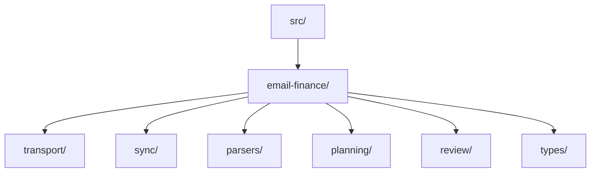

Suggested mapping:

- `transport/`
  - IMAP provider
  - HTTP bridge provider
  - provider contracts
- `sync/`
  - sync service
  - sync state store
  - coarse filter
- `parsers/`
  - parser contracts
  - parser registry
  - fiscal field parser
  - Yandex receipt parser
  - Ozon receipt parser
  - future vendor parsers
  - future HTML QR-grid parser
- `planning/`
  - generic message planner
  - planner unit types
- `review/`
  - pending proposal persistence
  - later approval/rejection transitions
- `types/`
  - email message and parser/planner shared types

Practical recommendation:

- keep cross-domain generic pieces in `services/`
- move email-intake-specific pieces into a dedicated feature folder once the next parser or approval flow lands
- do not move `FinanceIntakeService` or `ExpenseService`, because they are still shared application services rather than email-only internals

## 16. Known Gaps In The Current Design

- no scheduler outside the running Obsidian session; sync does not continue while the app is closed
- IMAP provider does not yet mark messages as processed server-side
- parser registry is still intentionally small; current concrete parsers are resolved-evidence, Magnit, Lenta, fiscal-field, Yandex receipt, Ozon receipt, generic receipt-link, and generic receipt-summary
- confirmed live coverage is now strongest for Yandex, Lenta, Magnit, and generic evidence-resolved receipt families
- some vendor families already have known internal format splits, for example legacy `ofd.ru`, `taxcom.ru`, and `lenta.com / upmetric / eco-check` Lenta receipts
- HTML QR-grid rendering is not parsed as a first-class receipt artifact yet
- inline `data:image/...` receipt QR sources are now visible in parser diagnostics, and some confirmed families such as legacy Lenta are already promoted into first-class receipt artifacts
- text-based PDF receipts are now much better covered, but scanned/image-only PDFs still remain outside the current deterministic path
- auth-gated receipt families such as Ozon still need either browser-assisted flow or an authenticated bridge
- merge heuristics are intentionally simple for now: type + currency + amount + near dateTime
- queue and duplicate-merge UIs now exist, but there is still no single unified Obsidian workspace that combines all review actions in one surface
- Telegram review exists through `/finance_review`, but duplicate merge in Telegram is intentionally triage-only and hands off to Obsidian for the actual merge
- email-sync notifications still point to the queue rather than to exact proposal note ids
- parser diagnostics are now much better, but some vendor-specific failures still require reading raw message artifacts and runtime trace together

Captured follow-up backlog from the latest stabilization pass:

- suggest or automate note path/file-name sync immediately after manual pending-note edits
- make Telegram pending-note preview richer by separating note body, source context, and artifact references more clearly
