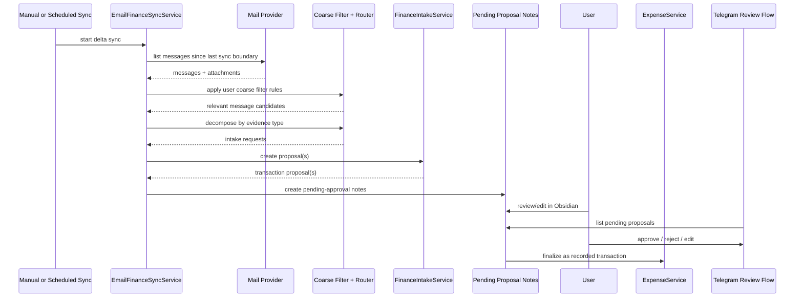

# Email Finance Intake RFC

Status:

- Proposed

Last updated:

- 2026-04-03

## Summary

This RFC proposes a new finance intake channel for `obsidian-expense-manager`:

- connect to a mailbox
- sync only messages newer than the previous successful sync boundary
- apply a user-editable coarse filter before expensive extraction
- run a chain of custom email parsers before generic planning
- classify the remaining messages by evidence type and route them through the existing finance intake paths
- allow one email to produce zero, one, or many finance proposals
- persist proposals as transaction notes with status `pending-approval`
- keep pending proposals out of analytics until the user approves them

The main architectural rule is:

`email is another finance transport, but its first persisted form is a pending transaction note, not an immediately recorded transaction`

That keeps the current architecture coherent while making email proposals visible and editable directly inside Obsidian.

## Why This Matters

A meaningful share of real finance evidence arrives by email before it reaches any manual workflow:

- store receipts
- online purchase confirmations
- invoices and payment confirmations
- subscription renewals
- bank operation notifications

Without email intake, the user still needs to:

- open the mailbox
- find the relevant message
- re-read the finance details
- retype or forward them into Obsidian or Telegram

That is exactly the kind of repeated friction this plugin should remove.

## Product Goal

Turn relevant emails into safe, reviewable transaction proposals with minimal manual typing while preserving user control.

Success looks like this:

1. The user configures mailbox access and coarse filter rules.
2. A sync processes only messages newer than the previous successful sync boundary.
3. Relevant messages are decomposed into one or more finance proposal candidates.
4. Proposal notes are created with status `pending-approval`.
5. The user reviews them in Obsidian or through Telegram review commands.
6. Only approved notes affect reports, dashboards, and budget alerts.

## Target Behavior

The target architecture should support both:

- explicit manual sync
- scheduled sync in later iterations

The first implementation does not need to ship scheduling immediately, but the model should be built so scheduled sync is a natural extension rather than a redesign.

## Non-Goals For The First Iteration

- full historical mailbox import across all old folders
- silent creation of fully recorded transactions without review
- generalized email routing for non-finance domains
- bank-statement reconciliation
- complex server-side mailbox rule management

## Current Architecture Fit

The existing service split already gives us a good foundation:

- [service-architecture.md](C:/Users/petro/OneDrive/Документы/codex_projects/obsidian/obsidian-expense-manager/docs/service-architecture.md)
- [finance-intake-service.ts](C:/Users/petro/OneDrive/Документы/codex_projects/obsidian/obsidian-expense-manager/src/services/finance-intake-service.ts)
- [ai-finance-intake-provider.md](C:/Users/petro/OneDrive/Документы/codex_projects/obsidian/obsidian-expense-manager/docs/ai-finance-intake-provider.md)
- [expense-service.ts](C:/Users/petro/OneDrive/Документы/codex_projects/obsidian/obsidian-expense-manager/src/services/expense-service.ts)

Today the intake layer already turns:

- structured text
- free-form text
- receipt images
- text-based PDF documents

into a shared `TransactionData` proposal shape.

Email should reuse those paths instead of inventing a second extraction stack.

There is also already a status concept in the PARA finance note types, so extending transaction lifecycle to include `pending-approval` fits the existing model direction better than inventing a separate hidden queue forever.

## Sync Boundary And Scheduling

Email sync should be incremental by default.

Primary rule:

- process only messages later than the previous successful sync boundary

Boundary strategy:

1. prefer a provider cursor when the mail source supports one
2. otherwise store a `lastSuccessfulSyncAt` watermark
3. optionally keep the last processed message ids around the boundary to reduce edge-case duplication

Why this matters:

- it keeps sync fast
- it makes scheduling realistic later
- it avoids rescanning the whole mailbox on every run

Future scheduling model:

- manual sync remains available
- a periodic background sync can later run on a configurable interval
- scheduled sync should reuse the same delta-sync boundary and the same proposal creation flow

## Two-Stage Filtering And Routing

The user feedback strongly suggests a two-stage pipeline.

### Stage 1. Coarse Filter

Use a cheap, user-editable filter before deeper extraction.

Possible rule inputs:

- sender address
- sender domain
- subject
- plain-text body preview
- HTML-to-text preview
- attachment names

Recommended rule capabilities:

- `contains`
- `startsWith`
- `endsWith`
- `regex` as an advanced option
- include and exclude rules

Suggested rule shape:

```ts
interface EmailCoarseFilterRule {
  id: string;
  enabled: boolean;
  field: "from" | "subject" | "body" | "attachmentName" | "any";
  mode: "contains" | "regex";
  pattern: string;
  action: "include" | "exclude";
}
```

Important product rule:

- the defaults should be simple and safe
- regex support should exist, but only as an advanced mode

### Stage 2. Evidence Routing

Messages that survive the coarse filter should then be routed by evidence type.

Preferred routing:

- image attachments -> QR-first route
- PDF attachments -> AI PDF route
- plain text or normalized HTML text -> AI text route

For images the rule should be:

- try deterministic QR extraction first
- if QR parsing fails and the image still looks finance-relevant, allow the existing AI image fallback path

That keeps receipts on the most reliable route while still supporting screenshots and non-QR cases.

## Multi-Proposal Model

One email must not be modeled as exactly one transaction.

Examples:

- one email with several receipt attachments
- one email body containing multiple charges
- one email with both a summary text and separate document attachments

The orchestration layer should therefore support:

- zero proposals from one email
- one proposal from one email
- many proposals from one email

Recommended implementation rule:

- keep the current `FinanceIntakeService` one-request-to-one-proposal shape where possible
- add an email-specific decomposition layer above it
- let one message fan out into multiple intake requests

This avoids forcing an immediate batch redesign of all existing intake providers.

For attachment-heavy emails, the decomposition can be straightforward:

- attachment A -> proposal request A
- attachment B -> proposal request B
- message text -> optional proposal request C

For text that contains multiple operations in one block, the first version can stay conservative:

- prefer explicit artifacts first
- only split message text into multiple proposals when the decomposition is sufficiently reliable

## Pending Note Workflow

Instead of keeping proposals only in plugin-local state, the preferred model is:

- create a finance transaction note immediately
- mark it with status `pending-approval`
- exclude it from reports and analytics until approval

Why this is preferable:

- the user can inspect the proposal directly in Obsidian
- the proposal becomes editable through normal note workflows
- Telegram and Obsidian can review the same source of truth
- restart safety becomes easier because pending proposals survive plugin reloads

This does mean the plugin writes proposal notes before final approval, but those notes are intentionally not treated as recorded transactions yet.

## Proposed User Flow



## Main Decision

The email feature should be modeled as:

- `transport`: mailbox access and delta sync
- `filtering`: cheap user-editable coarse filter rules
- `routing`: evidence-type selection and decomposition into intake requests
- `proposal persistence`: finance notes with `pending-approval` status
- `review`: Obsidian note editing plus Telegram review commands
- `analytics`: only `recorded` transactions participate

It should not be modeled as:

- a second direct-to-report pipeline
- silent creation of already-recorded transactions
- an opaque plugin-only queue that users cannot inspect

## Proposed Runtime Components

### 1. `FinanceMailProvider`

Provider boundary for mailbox access.

Responsibilities:

- authenticate against a mail source
- list messages after a sync boundary
- fetch message bodies and attachments
- expose stable provider ids
- optionally mark messages as processed

Suggested interface shape:

```ts
interface FinanceMailProvider {
  listMessages(options: { cursor?: string; since?: string }): Promise<MailSyncBatch>;
  getMessage(messageId: string): Promise<FinanceMailMessage>;
  markProcessed?(messageId: string, result: "pending" | "recorded" | "rejected" | "skipped"): Promise<void>;
}
```

### 2. `EmailFinanceSyncStateStore`

Stores the incremental sync boundary.

Responsibilities:

- last successful sync timestamp
- provider cursor when available
- recent processed message ids around the boundary
- mailbox/folder scope metadata

### 3. `EmailFinanceCoarseFilter`

Runs the cheap first-pass rules.

Responsibilities:

- evaluate include/exclude rules
- expose why a message passed or failed
- let users tune the filter over time

### 4. `EmailFinanceMessagePlanner`

Converts one message into candidate evidence units.

Responsibilities:

- run parser chain first
- inspect attachments and message text
- choose the best routing per unit
- fan one message out into many intake requests when needed

Routing rules:

- images -> QR-first receipt route
- PDFs -> AI PDF route
- text -> AI text route

### 4a. `EmailFinanceMessageParser` Chain

The planner should not encode every special case directly.

Instead, introduce a parser chain for custom email scenarios.

Responsibilities:

- inspect message-specific patterns before generic routing
- emit canonical planner units when a parser recognizes a scenario
- optionally stop further planning when the parser result is authoritative

Suggested interface shape:

```ts
interface EmailFinanceMessageParser {
  readonly id: string;
  parse(message: FinanceMailMessage): EmailFinanceParserResult | null;
}

interface EmailFinanceParserResult {
  parserId: string;
  units: PlannedEmailFinanceUnit[];
  stop: boolean;
}
```

Why this matters:

- vendor-specific logic stays isolated
- generic planner remains understandable
- new parsers can be added without rewriting the sync orchestration

Examples of parsers we should expect:

- fiscal-field parser
- Yandex receipt-link parser
- bank notification parser
- HTML receipt parser
- specialized parser for repeated vendor-specific HTML QR-grid formats

### 4b. Fiscal Receipt Extraction

One of the core parser responsibilities should be extracting canonical fiscal receipt fields from text or HTML when they are present:

- `t`
- `s`
- `fn`
- `i`
- `fp`
- `n`

These fields should be normalized into the canonical compact payload:

```text
t=<datetime>&s=<amount>&fn=<fn>&i=<i>&fp=<fp>&n=<1>
```

This is valuable because:

- it preserves receipt identity for dedupe
- it gives downstream logic a deterministic transport payload
- it avoids depending on AI alone when fiscal data is already present in the email

Important guardrail:

- only true compact QR-style payloads should go down the raw QR path
- an HTML email that merely contains a receipt link with `fn=...&fp=...` should not be mistaken for a raw QR string

### 5. `PendingFinanceProposalService`

Persists email-derived proposals as notes.

Responsibilities:

- create proposal notes with status `pending-approval`
- update existing pending notes on re-sync when appropriate
- attach artifacts
- link notes back to provider message metadata

### 6. Review Surfaces

The same pending proposal notes should be reviewable through:

- Obsidian directly
- a dedicated Telegram review command

Suggested Telegram responsibility:

- list notes with status `pending-approval`
- present proposal questions to the user
- allow approve, reject, and targeted edits

Command naming is still open, but the workflow itself should be treated as part of the design, not as an afterthought.

## Message And Proposal State Model

The sync layer needs stable state for both messages and proposals.

Suggested message states:

- `discovered`
- `filtered-out`
- `planned`
- `proposed`
- `partially-proposed`
- `failed`

Suggested proposal states:

- `pending-approval`
- `recorded`
- `archived`

Suggested stored message metadata:

- provider kind
- provider message id
- thread id when available
- sender
- subject
- received timestamp
- message fingerprint
- selected evidence fingerprints
- created proposal note ids or file paths
- last processing result
- failure reason when needed

Important nuance:

- one message can map to many proposals
- state therefore cannot assume a single proposal id per message

## Transaction Model Changes

The transaction model should recognize both email origin and approval lifecycle.

Planned source update:

- extend `TransactionSource` with `email`
- allow `email` in finance note validation

Planned status update:

- extend finance transaction statuses to include `pending-approval`
- keep `recorded` as the state for approved transactions
- keep `archived` for completed archival lifecycle

Recommended semantics:

- `pending-approval` means proposed but not yet counted
- `recorded` means approved and fully active in analytics
- `archived` means inactive historical state

Because transaction notes already have status in PARA mode, the implementation should also normalize status handling for standalone-mode frontmatter so the same lifecycle exists regardless of storage mode.

## Analytics Visibility Rule

This is the key safety rule for the proposal-note approach:

- `pending-approval` transactions must not appear in reports
- `pending-approval` transactions must not affect dashboard totals
- `pending-approval` transactions must not affect budget alerts
- duplicate detection should still consider both `pending-approval` and `recorded` notes

This likely requires updates in:

- transaction parsing
- report generation
- dashboard rendering
- Telegram summaries

## Artifact Policy

When a pending email proposal is created, keep the most relevant original artifact when useful:

- receipt PDF
- invoice PDF
- receipt image
- screenshot attachment

If the proposal comes only from text or HTML body:

- do not dump the entire raw email into `Attachments/Finance/` by default
- retain only the minimum metadata needed for deduplication and auditability

This keeps attachments useful without turning the finance archive into a mailbox mirror.

## HTML Receipt Caveat

Some email receipts do not include QR as:

- attached image
- embedded CID image
- linked PNG/JPEG

Instead, the QR can be rendered directly in HTML as a grid of black and white blocks.

This should not be treated as a normal generic image case by default.

Recommended strategy:

- first prefer extracting fiscal fields from the message text/HTML
- preserve relevant links and HTML context for downstream parsing
- add a dedicated parser for HTML QR-grid rendering only if the pattern proves stable and worth supporting

## Deduplication Strategy

Email import has two duplicate dimensions:

- the same message being processed again
- the same financial event entering through another channel

The strategy should therefore be layered:

1. sync-level dedupe
   - provider cursor
   - sync watermark
   - provider message id
2. message-level dedupe
   - message fingerprint
3. proposal-level dedupe
   - evidence fingerprint
   - message id + proposal fingerprint
4. transaction-level dedupe
   - existing fiscal-id logic
   - amount + datetime + description heuristics when fiscal ids are unavailable

If a likely duplicate is detected:

- the proposal can still be kept visible
- it should be clearly flagged before approval

## Telegram Review Flow

Pending proposals should be reviewable not only in Obsidian, but also in Telegram.

Target behavior:

- a Telegram command fetches notes with status `pending-approval`
- it turns them into focused approval prompts
- it allows approve, reject, and small edits

This is especially valuable because email sync can run unattended later, while Telegram remains the lightweight review surface.

The exact command name is open.

Working examples:

- `/finance_pending_approval`
- `/finance_review_pending`

The important part is not the name, but that the Telegram review flow reads from the same pending notes that Obsidian shows.

## MVP Scope

The recommended first delivery should already align with the long-term model.

### Included

- one mailbox source behind a provider abstraction
- delta sync using a previous successful sync boundary
- user-editable coarse filter rules
- evidence routing by attachment and text type
- image attachments routed QR-first
- PDF and text routed into AI-backed intake
- one email able to produce multiple pending proposal notes
- persisted `pending-approval` transaction notes
- analytics explicitly ignoring `pending-approval`
- manual review in Obsidian

### Deferred

- scheduled background sync
- advanced regex UX polish
- sophisticated multi-operation splitting from one free-form text body
- server-side mailbox labeling policies
- historical mailbox backfill
- rich Telegram bulk-review ergonomics

## Phased Delivery

### Phase 1. Model prep

- add `email` as a transaction source
- add `pending-approval` as a transaction status
- make analytics ignore pending proposals
- normalize status persistence across storage modes

### Phase 2. Delta sync and coarse filter

- add sync boundary state
- implement one mailbox provider
- add coarse filter rule storage and settings UI
- add manual sync command

### Phase 3. Routing and proposal persistence

- decompose relevant messages into evidence units
- route images, PDFs, and text through existing intake paths
- create pending proposal notes with linked artifacts and metadata

### Phase 4. Review flows

- support direct review/editing in Obsidian
- add approval/rejection transitions
- add duplicate warnings on proposal notes

### Phase 5. Telegram review

- add a Telegram command for `pending-approval` notes
- support approve, reject, and focused field edits

### Phase 6. Scheduled sync

- add configurable background polling
- reuse the same delta boundary and proposal creation logic

## Security And Privacy

This feature touches sensitive data and should stay conservative.

Minimum rules:

- store only the minimum message metadata needed for idempotency and auditability
- do not retain raw email bodies in vault notes by default
- do not send a whole mailbox to AI providers
- send only the selected relevant evidence unit for one candidate
- keep provider credentials and tokens clearly scoped in settings

## Open Questions

- Which first mail provider fits the Obsidian desktop runtime best?
- Should regex support be enabled from the start or hidden behind an advanced toggle?
- How should rejected pending notes be handled by default: delete, archive, or keep with a terminal status?
- How aggressive should multi-operation splitting be for plain-text emails?
- Should scheduled sync run only while Obsidian is open, or should it integrate with broader automation later?
- What should the final Telegram command naming be for pending proposal review?

## Recommendation

Proceed with email intake as the next finance-productization slice, but with the refined model captured in this feedback:

- delta sync by previous successful processing boundary
- user-tunable coarse filtering
- parser-first planning with a custom email parser chain
- evidence-based routing
- canonical fiscal field extraction when available
- support for many proposals from one email
- persisted `pending-approval` notes as the review substrate
- later scheduled sync and Telegram review on top of the same note state

That keeps the feature practical for real usage while staying aligned with the architecture the project already has.
