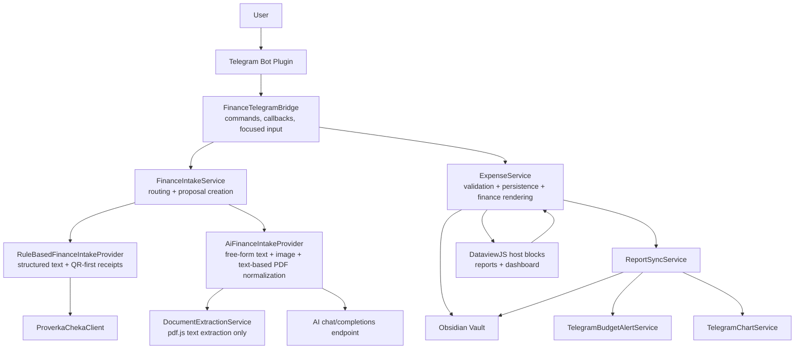
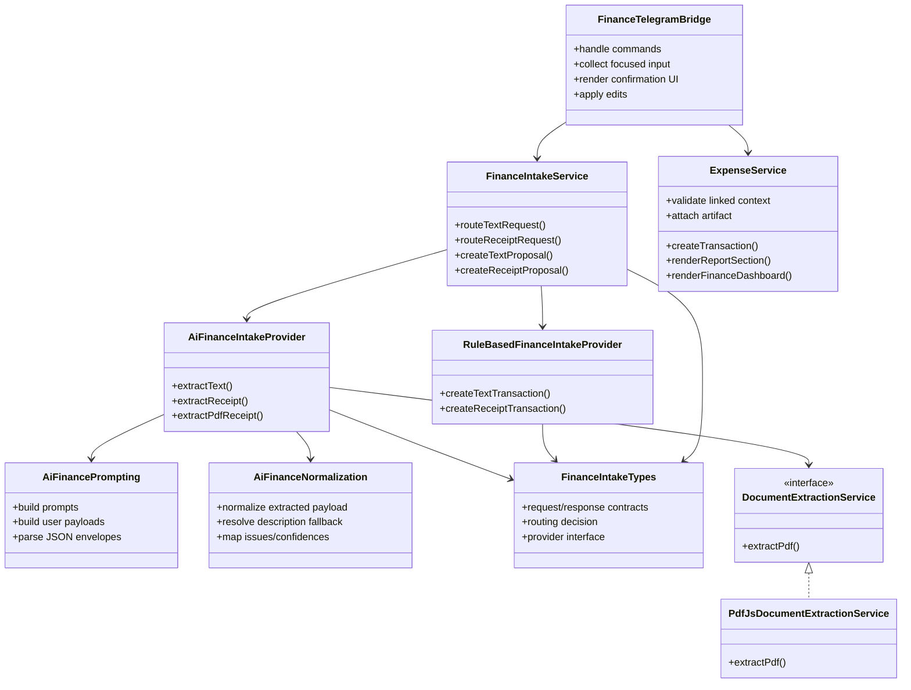
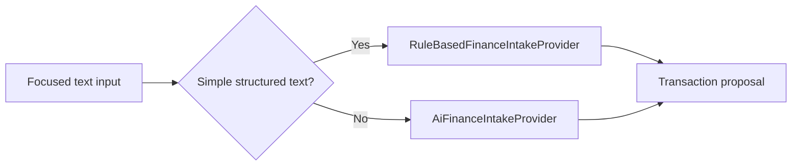
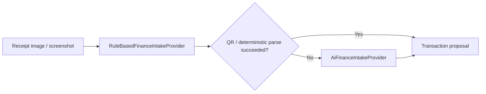
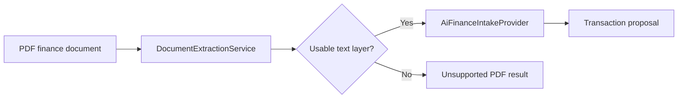
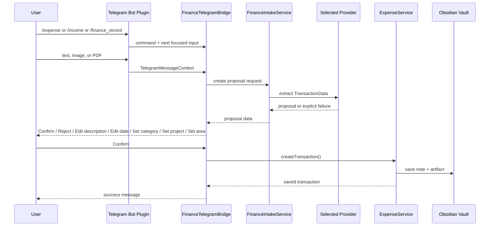

# Expense Manager Service Architecture

This document describes the current runtime structure of `obsidian-expense-manager` after the finance intake simplification pass.

The main architectural rule for the current iteration is:

`explicit Telegram intent -> proposal creation -> human confirmation -> vault write`

## Current Runtime View

## Current Responsibilities

## Intake Paths

### Text

### Receipt Image

### PDF

Important current limitation:

- only `text-based PDF` is supported
- scanned, image-only, or otherwise textless PDF is rejected explicitly

## Telegram Finance Flow

Artifact storage convention:

- standalone mode stores transaction notes under `<Expense folder>/YYYY/MM/`
- PARA Core mode stores transaction notes under `Records/Finance/Transactions/YYYY/MM/`
- standalone mode stores artifacts under `<Expense folder>/Artifacts/YYYY/MM/`
- PARA Core mode stores artifacts under `Attachments/Finance/YYYY/MM/`
- the stored file name receives a timestamp prefix derived from the same placement date
- for finance flows, transaction note placement and artifact timestamping both use the transaction date

## Shared Runtime Logging

`Expense Manager` no longer owns a separate vault debug-log file.

Instead it joins the shared `PARA Core` runtime log:

- main plugin startup uses a scoped shared logger
- finance intake services use the same shared logger
- runtime warnings and errors from report sync, Telegram finance flows, and parsing paths now land in the common ecosystem log

This keeps investigation simpler:

- one logging policy
- one shared file path owned by `PARA Core`
- one place to look when a cross-plugin issue shows up during normal vault usage

## Report And Dashboard Rendering

Finance report notes and PARA dashboard widgets now use the same rendering model:

- markdown stays lightweight
- `DataviewJS` is used only as a host layer
- heavy filtering, aggregation, table building, and chart rendering live in `ExpenseService`
- report note frontmatter remains the integration and budget source of truth

In practice this means:

- generated report notes store compact frontmatter plus thin `DataviewJS` sections
- each section calls the public plugin API instead of defining large inline scripts
- PARA dashboard contributions also call the same plugin API, so dashboard markdown stays minimal

This removes the old dependency on monolithic inline rendering code and keeps report and dashboard visuals consistent.

## Startup Report Sync

Automatic report sync has one startup-specific rule:

- do not run the first background sync directly inside plugin `onload`

Instead, `ReportSyncService` opens a dedicated startup gate:

- primary signal: `app.metadataCache.on('resolved')`
- fallback signal: `app.workspace.onLayoutReady(...)` plus a short timeout
- execution rule: open only once, then run the startup sync

Why this exists:

- managed report files may already be present on disk
- during cold startup, Obsidian can still be warming up the Vault and metadata indexes
- if sync runs too early, an upsert can miss the existing indexed `TFile` and hit a false `File already exists` conflict

This policy is centralized in:

- [startup-sync-gate.ts](C:/Users/petro/OneDrive/Документы/codex_projects/obsidian/obsidian-expense-manager/src/services/startup-sync-gate.ts)
- [report-sync-service.ts](C:/Users/petro/OneDrive/Документы/codex_projects/obsidian/obsidian-expense-manager/src/services/report-sync-service.ts)

## Why The Current Shape Is Simpler

The previous iteration experimented with:

- a custom PDF parser fallback
- rendered-page vision fallback for PDF

Those paths were removed from the current design because they increased code size and debugging cost faster than they increased reliability.

The current design prefers:

- one supported PDF strategy
- explicit unsupported results for out-of-scope documents
- simpler logs
- simpler mental model for maintenance

## Current File Split

- [finance-intake-service.ts](C:/Users/petro/OneDrive/Документы/codex_projects/obsidian/obsidian-expense-manager/src/services/finance-intake-service.ts)
  - orchestration only
- [finance-intake-types.ts](C:/Users/petro/OneDrive/Документы/codex_projects/obsidian/obsidian-expense-manager/src/services/finance-intake-types.ts)
  - shared intake contracts
- [rule-based-finance-intake-provider.ts](C:/Users/petro/OneDrive/Документы/codex_projects/obsidian/obsidian-expense-manager/src/services/rule-based-finance-intake-provider.ts)
  - deterministic text and QR-first logic
- [ai-finance-intake-provider.ts](C:/Users/petro/OneDrive/Документы/codex_projects/obsidian/obsidian-expense-manager/src/services/ai-finance-intake-provider.ts)
  - AI-backed extraction flow
- [expense-service.ts](C:/Users/petro/OneDrive/Документы/codex_projects/obsidian/obsidian-expense-manager/src/services/expense-service.ts)
  - transaction persistence, report calculations, compact report-note rendering, and dashboard rendering API
- [register-template-contributions.ts](C:/Users/petro/OneDrive/Документы/codex_projects/obsidian/obsidian-expense-manager/src/integrations/para-core/register-template-contributions.ts)
  - thin PARA template and dashboard host blocks

## Near-Term Direction

The current architecture is intentionally conservative.

The next evolution should happen only if it is justified by real usage:

- improve AI proposal quality inside the existing boundaries
- keep Telegram confirmation UX as the stable control point
- revisit OCR/scanned-PDF support only as a separate, clearly scoped iteration
