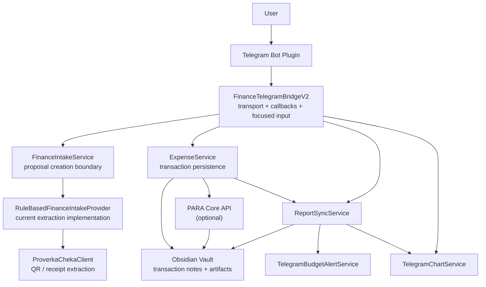
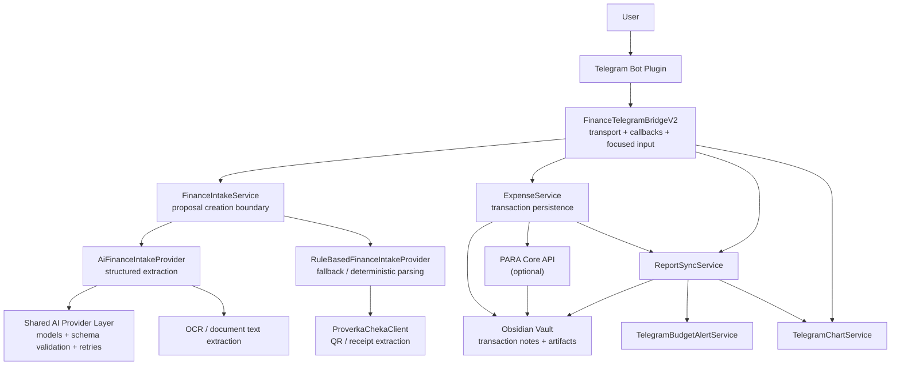
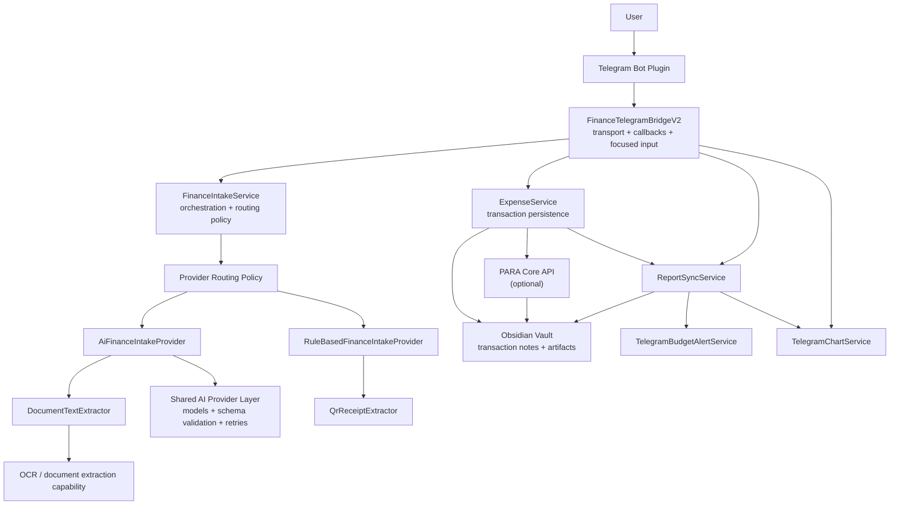
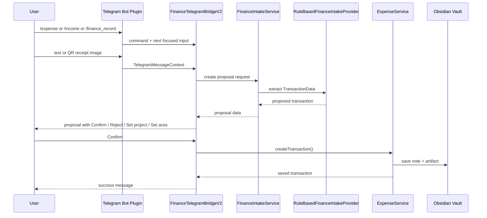

# Expense Manager Service Architecture

This document describes the main runtime interactions inside `obsidian-expense-manager`, with special focus on the updated Telegram finance intake flow.

## Current State

This is the architecture that exists now.

## Near-Term Future State With AI Provider

This is the intended next step after AI-backed extraction is added, but before the extraction concerns are fully separated into their own dedicated layer.

## More Mature Target Architecture

This is a cleaner long-term architecture after provider routing and extraction capabilities are separated more explicitly.

## Main Responsibilities

- `FinanceTelegramBridgeV2`
  - owns Telegram v2 transport integration
  - handles commands, callbacks, focused input, and proposal confirmation UX
  - does not own business persistence rules or low-level extraction logic

- `FinanceIntakeService`
  - is the internal boundary for finance intake
  - turns raw Telegram inputs into proposed `TransactionData`
  - is the intended seam for a future AI-backed provider

- `RuleBasedFinanceIntakeProvider`
  - is the current implementation behind `FinanceIntakeService`
  - parses explicit text inputs
  - prepares receipt-based proposals from QR processing
  - can later be replaced or augmented by an `AiFinanceIntakeProvider`

- `ExpenseService`
  - validates linked `project` and `area`
  - attaches artifacts
  - performs duplicate detection
  - persists transactions either directly to the vault or through PARA Core integration

- `ReportSyncService`
  - rebuilds period reports from transactions
  - keeps cumulative balances correct
  - coordinates budget-state-aware report generation

- `TelegramChartService`
  - renders PNG chart outputs for Telegram reports

- `TelegramBudgetAlertService`
  - manages Telegram-oriented budget alert behavior

## Telegram Finance Intake Flow

## Boundary for Future AI Integration

The intended next evolution is:

- keep `FinanceTelegramBridgeV2` as the Telegram-facing UX layer
- keep `ExpenseService` as the persistence and domain-validation layer
- introduce an AI-backed provider behind `FinanceIntakeService`

That keeps responsibilities stable:

- transport stays in Telegram bridge
- extraction stays in intake provider
- persistence stays in expense service

This separation is important because the future `AI provider` should improve proposal quality without forcing a rewrite of Telegram flows or finance storage behavior.

## Evolution Summary

- Current state:
  - `FinanceIntakeService` delegates to a rule-based provider
  - receipt enrichment comes from QR-oriented extraction
  - Telegram owns capture and confirmation UX

- Near-term future state:
  - `FinanceIntakeService` can route to an AI-backed provider
  - AI extraction can use OCR, multimodal understanding, and schema validation
  - rule-based parsing can remain as fallback for deterministic or low-cost paths

- More mature target:
  - `FinanceIntakeService` owns orchestration and routing policy explicitly
  - extraction capabilities are separated from providers
  - QR extraction and document extraction stop being implied as “owned” by one provider
  - AI and deterministic paths share clearer infrastructure boundaries
