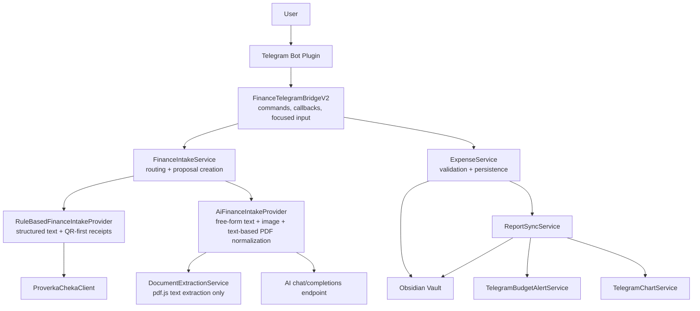
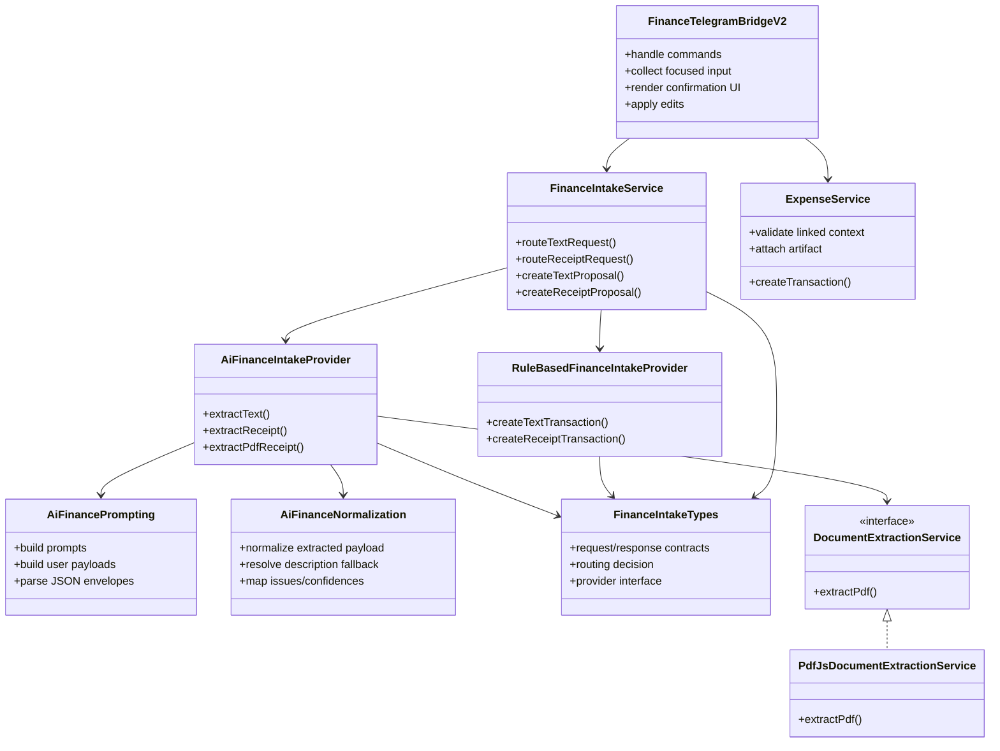
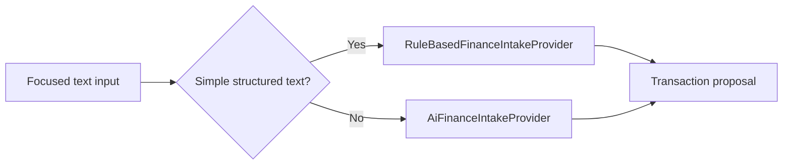
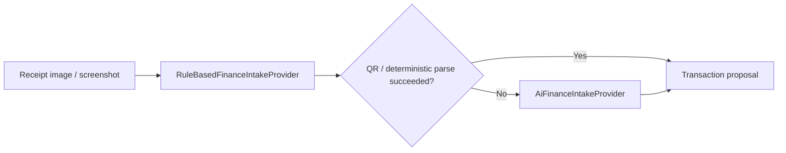
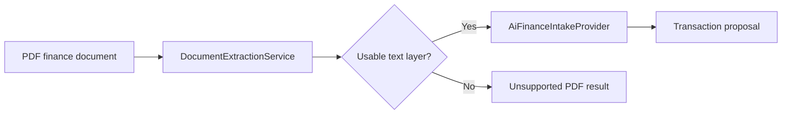
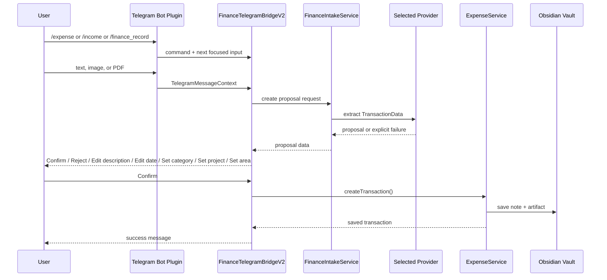

# Expense Manager Service Architecture

This document describes the current runtime structure of `obsidian-expense-manager` after the finance intake simplification pass.

The main architectural rule for the current iteration is:

`explicit Telegram intent -> proposal creation -> human confirmation -> vault write`

## Current Runtime View

## Current Responsibilities

## Intake Paths

### Text

### Receipt Image

### PDF

Important current limitation:

- only `text-based PDF` is supported
- scanned, image-only, or otherwise textless PDF is rejected explicitly

## Telegram Finance Flow

## Why The Current Shape Is Simpler

The previous iteration experimented with:

- a custom PDF parser fallback
- rendered-page vision fallback for PDF

Those paths were removed from the current design because they increased code size and debugging cost faster than they increased reliability.

The current design prefers:

- one supported PDF strategy
- explicit unsupported results for out-of-scope documents
- simpler logs
- simpler mental model for maintenance

## Current File Split

- [finance-intake-service.ts](C:/Users/petro/OneDrive/Документы/codex_projects/obsidian/obsidian-expense-manager/src/services/finance-intake-service.ts)
  - orchestration only
- [finance-intake-types.ts](C:/Users/petro/OneDrive/Документы/codex_projects/obsidian/obsidian-expense-manager/src/services/finance-intake-types.ts)
  - shared intake contracts
- [rule-based-finance-intake-provider.ts](C:/Users/petro/OneDrive/Документы/codex_projects/obsidian/obsidian-expense-manager/src/services/rule-based-finance-intake-provider.ts)
  - deterministic text and QR-first logic
- [ai-finance-intake-provider.ts](C:/Users/petro/OneDrive/Документы/codex_projects/obsidian/obsidian-expense-manager/src/services/ai-finance-intake-provider.ts)
  - AI-backed extraction flow

## Near-Term Direction

The current architecture is intentionally conservative.

The next evolution should happen only if it is justified by real usage:

- improve AI proposal quality inside the existing boundaries
- keep Telegram confirmation UX as the stable control point
- revisit OCR/scanned-PDF support only as a separate, clearly scoped iteration
